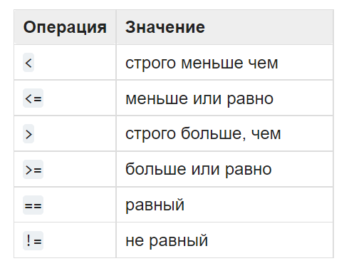
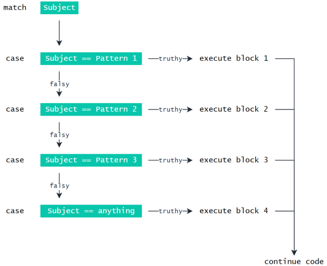

# Условные конструкции, булева логика и сравнения

!!! info "Автор(ы)"

    - [Котенков Игорь](https://github.com/stalkermustang)
    - [Baushenko Mark](https://github.com/e0xextazy)

## Ветвление логики

В прошлых лекциях рассмотрели программы с линейной структурой: сначала выполнялась первая конструкция (например, объявление переменной), затем вторая (преобразование переменной или расчет по формуле), после – третья (`print` для вывода результатов). Можно сказать, что происходило последовательное исполнение команд, причем каждая инструкция выполнялась ^^обязательно^^. Но что делать, если хочется опираться на обстоятельства и принимать решения о том, выполнять одну часть кода или другую?

Допустим, по числу `x` нужно определить его абсолютную величину, то есть модуль. Программа должна напечатать значение переменной `x`, если `x > 0` или же величину `-x` в противном случае (`-(-5) = 5`). Эту логику можно записать следующим образом:

```python linenums="1"
x = -3  # попробуйте поменять значение переменной

if x > 0:
    print("Исходный x больше нуля")
    print(x)
else:
    print("Исходный x меньше или равен нулю")
    print(-x)
```
```bash
Исходный x меньше или равен нулю
3
```

В этой программе используется условная инструкция `if` (в переводе с английского _«если»_) – это ключевое зарезервированное слово (так нельзя назвать свою переменную), указывающее на условную конструкцию. После `if` следует указать вычислимое выражение, которое можно проверить на истинность (то есть можно сказать, правда это или нет). Общий вид конструкции следующий:

```python linenums="1"
if (Условие):
    <Блок инструкций 1>
else:
    <Блок инструкций 2>
```

`else` – тоже ключевое слово (в переводе – «иначе»). Таким образом, можно в голове придерживаться такой интерпретации: «^^если^^ условие верно (истинно), ^^то^^ выполни первый блок команд, ^^иначе^^ выполни второй блок».

Условная инструкция содержит как минимум ключевое слово `if` (единожды), затем может идти любое количество (включая ноль) блоков с условием `else if <условие>` (_иначе если_, то есть будет выполнена проверка нового условия в случае, если первая проверка в `if` не прошла, кратко `else if` записывается как `elif`), затем – опционально – конструкция `else`. Логика чтения и выполнения кода сохраняет порядок ^^сверху вниз^^. Как только одно из условий будет выполнено, выполнится соответствующая инструкция (или набор инструкций), а все последующие блоки будут проигнорированы. Это проиллюстрировано в коде:

```python linenums="1"
x = -3.8  # попробуйте поменять значение переменной

if x > 0:
    print("x больше нуля")
elif x < 0:  # можно написать "else if x < 0:"
    print("x меньше нуля")
else:
    print("x в точности равен нулю")
print("Такие дела!")
```
```bash
x меньше нуля
Такие дела!
```

Понятно, что `x` не может одновременно быть и больше нуля, и меньше (или равен ему). Среди всех трех `print`-блоков будет выполнен ^^только один^^. Если `x` действительно больше нуля, то второе условие (`x < 0`) даже не будет проверяться – Python сразу же перейдет к последней строке и выведет надпись «Такие дела!».

Чтобы лучше разобраться в том, как работает код, можно использовать ^^визуализаторы^^ – например, [такой](https://pythontutor.com/visualize.html). Прогоняйте через него весь код (даже в несколько строк) и сверяйте со своими ожиданиями от его работы.

## А что вообще такое эти ваши условия?

Выше было указано, что после конструкций `if`/`else if`/`elif` необходимо указать условие, которое еще и должно быть истинным или ложным («правда или нет»). Давайте попробуем определить необходимый тип переменной.

```python linenums="1"
x = -3.8

condition_1 = x > 0
condition_2 = x < 0

print(condition_1, type(condition_1))
print(condition_2, type(condition_2))
```
```bash
False <class 'bool'>
True <class 'bool'>
```

Видно, что оба условия имеют один и тот же тип - `bool`, то есть `boolean`. По [определению](https://developer.mozilla.org/ru/docs/Glossary/Boolean):

!!! note "Замечание"

    Boolean (Булев, Логический тип данных) – примитивный тип данных в информатике, которые могут принимать 2 возможных значения, иногда называемых истиной (True) и ложью (False).

Оказывается, что в коде выше были получены ^^все^^ возможные варианты булевой переменной – это истина (`True`, пишется только с заглавной буквы) и ложь (`False`, аналогично). Никаких других значений быть для условия не может. Вот такой это простой тип данных.

## Способы получения `bool`

Какими вообще могут быть условия? Как с ними можно обращаться? Согласно [официальной документации](https://docs.python.org/3/library/stdtypes.html), в Python есть такие операторы сравнения:

<figure markdown>
  
  <figcaption>
  Все операции сравнения работают нативно (так же, как и в математике)
  </figcaption>
</figure>

```python linenums="1"
print(3.0 > 3)
print(3.0 == 3)
```
```bash
False
True
```

Здесь практически нечего рассматривать, операторы сравнения они и в Python операторы. Куда интереснее принцип ^^объединения различных условий в одно^^ – для создания комплексной логики.

Пусть стоит задача определения четверти точки по ее координатам на двумерной плоскости. Решение такой задачи может быть записано следующим образом:

```python linenums="1"
x = -3.6
y = 2.5432

if x > 0:
    if y > 0:
        # x > 0, y > 0
        print("Первая четверть")
    else:
        # x > 0, y < 0
        print("Четвертая четверть")
else:
    if y > 0:
        # x < 0, y > 0
        print("Вторая четверть")
    else:
        # x < 0, y < 0
        print("Третья четверть")
```
```bash
Вторая четверть
```

Пример показывает, что выполняемым блоком кода может быть любой блок Python, включая новый логический блок с `if-else` конструкцией. Однако его можно сократить с помощью ^^логических операторов^^ `and`, `or` и `not`. Это стандартные логические операторы [булевой алгебры](https://ru.wikipedia.org/wiki/Булева_алгебра).

Логическое ^^И^^ является бинарным оператором (то есть оператором с двумя операндами: левым и правым) и имеет вид `and`. Оператор `and` возвращает `True` тогда и только тогда, когда ^^оба его операнда имеют значение^^ `True`.

Логическое ^^ИЛИ^^ является бинарным оператором и возвращает `True` тогда и только тогда, когда ^^хотя бы один операнд равен^^ `True`. Оператор «логическое ИЛИ» имеет вид `or`.

Логическое ^^НЕ^^ (отрицание) является унарным (то есть ^^с одним операндом^^) оператором и имеет вид `not`, за которым следует единственный операнд. Логическое НЕ возвращает `True`, ^^если операнд равен^^ `False` и ^^наоборот^^.

Эти правила необходимо запомнить для успешного создания сложных условий с целью разделения логики, заложенной в Python-коде.

Проиллюстрируем правила в коде на простых примерах. Обратите внимание на то, как можно объявлять `bool`-переменные – это не сложнее, чем создание целочисленного значения:

```python linenums="1"
true_value = True
false_value = False

# False потому, что один из операндов является False
some_value = true_value and false_value
print(some_value)

# True потому, что хотя бы один из операндов равен True
some_value = true_value or false_value
print(some_value)

# отрицание True (истины) есть False (ложь)
some_value = not true_value
print(some_value == false_value)

# пример сложного условия - порядок лучше в явном виде задавать скобками
hard_condition = (not true_value or false_value) or (true_value != false_value)
print(hard_condition)
```
```bash
False
True
True
True
```

Теперь попробуем их применить на приближенных к практике примерах:

```python linenums="1"
x = -3.6
y = 2.5432

if x > 0 and y > 0:  # конструкция заменяет два вложенных if
    print("Первая четверть")
elif x > 0 and y < 0:
    print("Четвертая четверть")
elif y > 0:
    print("Вторая четверть")
else:
    print("Третья четверть")

# определим, большое ли число x (в терминах модуля)
x_is_small = (x < 3) and (x > -3)
# число большое, если оно не маленькое (по модулю)
x_is_large = not x_is_small  # можно отрицать факт малости x

print("Is x small? ", x_is_small)
print("Is x large? ", x_is_large)

# так тоже можно писать - на манер неравенств в математике
another_x_is_small = -3 < x < 3
print(another_x_is_small)
print(another_x_is_small == x_is_small)
```
```bash
Вторая четверть
Is x small?  False
Is x large?  True
False
True
```

Так как вторая переменная `x_is_large` – это отрицание (`not`) первой (`x_is_small`), то они ^^никогда^^ не будут равны.

## Блоки кода и отступы

В примерах выше наверняка заметили упоминание термина «блок кода», а также откуда-то взявшиеся отступы после условий, и это не случайно. Во-первых, давайте признаем, что так условные конструкции (особенно вложенные!) читать куда легче, и глаза не разбегаются. Во-вторых, это особенность языка Python – здесь не используются скобки `{`, `}` для указания блоков, все форматирование происходит с помощью отступов. Отступы ^^всегда^^ добавляются в строки кода ^^после двоеточия^^.

Для выделения блока инструкций (строк кода, выполняющихся подряд при любых условиях), относящихся к инструкциям `if`, `else` или другим, изучаемым далее, в языке Python используются ^^отступы^^. Все инструкции, которые относятся к одному блоку, должны иметь ^^равную величину отступа^^, то есть одинаковое число ^^пробелов в начале строки^^. В качестве отступа [PEP 8](https://www.python.org/dev/peps/pep-0008/#tabs-or-spaces) рекомендует использовать ^^отступ в четыре пробела^^ и не рекомендует использовать символ табуляции. Если нужно сделать еще одно вложение блока инструкций, достаточно добавить еще четыре пробела (см. пример выше с поиском четверти на плоскости).

!!! tip "Совет"

    Хоть и не рекомендуется использовать символ табуляции для создания отступов, кнопка ++tab++ на клавиатуре в `Jupyter`-ноутбуке (при курсоре, указывающим на начало строки кода) создаст отступ в четыре пробела. Пользуйтесь этим, чтобы не перегружать клавишу пробела лишними постукиваниями.

## Контекстные менеджеры

Контекстные менеджеры это ^^специальные конструкции^^, которые представляют из себя блоки кода, заключенные в инструкцию `with`. Простейшей функцией, использующей данный протокол является функция `open()`. Каждый раз, когда открывается файл его необходимо закрыть, чтобы записать выходные данные на диск (на самом деле Python вызывает метод `close()` автоматически, но явное его использование ^^является хорошим тоном^^). Например:

```python linenums="1"
fp = open("./file.txt", "w")
fp.write("Hello, World!")
fp.close()
```

Чтобы каждый раз не вызывать метод `close()`, можно воспользоваться контекстным менеджером функции `open()`, который автоматически закроет файл после выхода из блока:

```python linenums="1"
with open("./file.txt", "w") as fp:
    fp.write("Hello, World!")
```

Для определения переменной, которая будет содержать контекстный менеджер используется инструкция `as` после которой идет сама переменная. Но есть и другой способ задать переменную для контекстного менеджера:

```python linenums="1"
with (fp := open("file.txt", "w")):
    fp.write("Hello, World!")
```

В данном случае используется оператор `:=`.

Что же делать, если нужно вести запись в 2 файла одновременно? На помощь приходят контекстные менеджеры в круглых скобках:

```python linenums="1"
with (
    open("./file1.txt", "w") as fp1,
    open("./file2.txt", "w") as fp2
):
    fp1.write("Hello, World 1!")
    fp2.write("Hello, World 2!")
```

В данном случае создадутся 2 файла на диске с именем `file1.txt` и `file2.txt`, которые будут содержать строчки «Hello, World 1!» и «Hello, World 2!» соответственно. Но какой ещё вид могут иметь контекстные менеджеры в круглых скобках? Вот несколько примеров как их можно использовать в коде:

```python linenums="1"
with (CtxManager() as example):
    ... # Какой-то блок кода

with (
    CtxManager1(),
    CtxManager2()
):
    ... # Какой-то блок кода

with (
    CtxManager1() as example,
    CtxManager2()
):
    ... # Какой-то блок кода

with (
    CtxManager1(),
    CtxManager2() as example
):
    ... # Какой-то блок кода

with (
    CtxManager1() as example1,
    CtxManager2() as example2
):
    ... # Какой-то блок кода
```

!!! warning "Внимание"

    В данном разделе, все примеры содержали только одну функцию/протокол `open()`, так как цель раздела ознакомиться со структурой контекстного менеджера, а не с функционалом протоколов. Позже будут разбираться протоколы и как их писать с нуля.

## `Match-case` конструкция (структурное сопоставление с шаблоном)

Сопоставление подразумевает определение при операторе `match` искомого значения, после которого можно перечислить несколько ^^потенциальных вариантов ветвления^^ («кейсов» от слова case), каждый с оператором `case`. В месте обнаружения совпадения между `match` и `case` выполняется соответствующий блок кода. Например:

```python linenums="1"
http_code = "418"

match http_code:
    case "200":
        print("OK")
    case "404":
        print("Not Found")
    case "418":
        print("I'm a teapot")
    case _:
        print("Code not found")
```
```bash
I'm a teapot
```

Здесь происходит проверка ^^нескольких условий^^ и выполнение разных операций на основе значения, которое находится внутри `http_code`.



Сразу становится очевидным, что «да», можно выстроить ту же логику, используя набор инструкций `if-elif-else`, например:

```python linenums="1"
http_code = "418"

if http_code == "418":
    print("OK")
elif http_code == "404":
    print("Not Found")
elif http_code == "418"
    print("I'm a teapot")
else:
    print("Code not found")
```
```bash
I'm a teapot
```

Тем не менее, с помощью инструкций `match-case` можно избавиться от повторения `http_code ==`, что ^^повышает чистоту кода^^ при тестировании на соответствие многим разным условиям.

!!! note "Замечание"

    Инструкция `match-case` позволяет проверять на совпадение не только тип субъекта, но и его структуру.

Если все ещё не верите в удобство этой инструкции, давайте посмотрим на пример, после которого точно не будет сомнений:

```python linenums="1"
x = ("0.0.0.0", "8000")

match x:
    case host, port:
        mode = "http"
    case host, port, mode:
        pass

print(host, port, mode)
```
```bash
0.0.0.0 8000 http
```

Здесь ожидается получение деталей соединения в формате кортежа и присваивание их нужным переменным.

В этом случае, если `mode` соединения в кортеже не определен (например, было передано только два значения – `host` и `port`), предполагается, что режим соединения `http`. Тем не менее в других случаях можно ожидать, что режим будет определен явно. Тогда вместо этого будет передан кортеж вида `(<host>, <port>, "ftp")`, и `mode` уже не устанавливается как `http`, например:

```python linenums="1"
x = ("0.0.0.0", "8000", "ftp")

match x:
    case host, port:
        mode = "http"
    case host, port, mode:
        pass

print(host, port, mode)
```
```bash
0.0.0.0 8000 ftp
```

Если прописать ту же логику с помощью `if-elif-esle`, то получится громоздкая конструкция:

```python linenums="1"
if isinstance(x, tuple) and len(x) == 2:
    host, port = x
    mode = "http"
elif isinstance(x, tuple) and len(x) == 3:
    host, port, mode = x
```

```python linenums="1"
x = ("0.0.0.0", "8000")
print(host, port, mode)
```
```bash
0.0.0.0 8000 http
```

```python linenums="1"
x = ("0.0.0.0", "8000", "ftp")
print(host, port, mode)
```
```bash
0.0.0.0 8000 ftp
```

Как можно видеть, здесь явно проверяется ^^тип входного значения^^ с помощью функции `isinstance()` и ^^структура^^ с помощью функции `len()`.

## Что узнали из лекции

- Для задания логики выполнения кода и создания нелинейности используются ^^условные инструкции^^, поскольку они следуют некоторым условиям.
- Условная инструкция задается ключевым словом `if`, после которого может следовать несколько (от нуля) блоков `else if`/`elif`, и – опционально – в конце добавляется `else`, если ни один из блоков выше не сработал.
- Условия должны быть ^^булевого типа^^ (`bool`) и могут принимать ^^всего два значения^^ – `True` и `False`. Выполнится тот блок кода, который задан истинным (`True`) условием (и только первый!).
- Условные конструкции можно вкладывать друг в друга, а также объединять с помощью ^^логических операторов^^ `and`, `or` и `not`.
- ^^Блок кода^^ – это несколько подряд идущих команд, которые будут выполнены последовательно.
- Чтобы выделить блок кода после условия, используйте ^^отступы^^ – четыре пробела.
- Чтобы создать отступ в `Jupyter`, нужно нажать ++tab++ в начале строки кода.
- Упростить закрытие файлов можно с помощью контекстного менеджера.
- Если логика кода подразумевает ^^большое использование сравнений^^ или ^^сложные логические конструкции^^, то лучшим вариантом будет воспользоваться инструкцией `match-case`.
