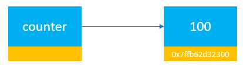
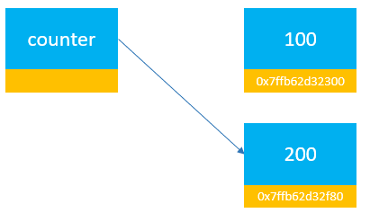

# Словари

!!! info "Автор(ы)"

    - [Овсянникова Александра](https://github.com/alexmorphine)

## Что такое `dict`

`dict` (от английского _"dictionary"_, словарь) – еще один тип данных в Python. Словари хранят пары `ключ`: `значение`. То есть в списках можно достать элемент, если указать его позицию в виде целого числа, а в словарях – тот самый `ключ`. Обратите внимание, `dict` – ^^неупорядоченный^^ тип данных, поэтому достать элемент по номеру не получится, но отображение содержимого будет ^^в порядке добавления^^ элементов. ^^Уникальность^^ ключей должна поддерживаться, чтобы всегда можно было быстро найти одно единственно верное `значение`.

В некоторых языках программирования можно встретить ассоциативные массивы – полную аналогию `dict`. Также вспомним базы данных, широко использующиеся во всём мире для хранения информации: в таблице можно установить первичный ключ, который уникально идентифицирует запись, как и `ключ` соответствует `значению` в словаре. Самый простой пример ключа - порядковый номер объекта!

### Создание словаря

Использовать словарь стоит, когда нужно сохранять объекты с какими-то ключами и обращаться к объектам по известным ключам. Один из способов определения словаря: указание пар `ключ`: `значение` через ^^запятую^^ внутри фигурных скобок `{}`. Напоминает `set`, правда? `{}` позволяет создать ^^пустой^^ словарь, но не пустое множество.

Например, вы решили упростить себе жизнь и больше не запоминать дни рождения коллег. Вместо этого, лучше хранить их в одном месте:

```python linenums="1"
# локально попробуйте поменять значение переменной dates
dates = {"Кунг Фьюри": "1968-09-09", "Наташа Романова": "1985-03-15"}
print(dates)
```
```bash
{'Кунг Фьюри': '1968-09-09', 'Наташа Романова': '1985-03-15'}
```

В примере `dates` имеет две пары значений. В первой паре строка `"Кунг Фьюри"` является _ключом_, а `"1968-09-09"` – его _значением_.

### Получение значения по ключу

Чтобы получить значение по ключу, необходимо обратиться к переменной, содержащей словарь, и указать ключ в квадратных скобках `[]`:

```python linenums="1"
dates["Кунг Фьюри"]
```
```bash
'1968-09-09'
```

Если указать неверный ключ в `[]`, Python будет ругаться: выбросит ошибку `KeyError` и перестанет выполнять код. Чуть ниже посмотрим, как можно избежать таких ситуаций.

```python linenums="1"
# пока этого ключа нет в словаре, будет ошибка при обращении
# поэтому используем перехват ошибок
try:
    print(dates["Капитан Ямайка"])

except KeyError as e:
    print(f"Ключа действительно нет: {e}")
```
```bash
Ключа действительно нет: 'Капитан Ямайка'
```

### Изменение и добавление значений

Синтаксис изменения значения по ключу и добавления нового ключа со значением одинаковый: в `[]` нужно указать ключ, поставить `=` и указать значение, которое теперь будет соответствовать ключу.

```python linenums="1"
# этот ключ уже был в примере
dates["Кунг Фьюри"] = "1960-09-09"

# а такого не было
dates["Капитан Ямайка"] = "1930-10-04"

print(dates)
```
```bash
{'Кунг Фьюри': '1960-09-09', 'Наташа Романова': '1985-03-15', 'Капитан Ямайка': '1930-10-04'}
```

Если ключ уже был в словаре, значение по нему изменится на новое, а ^^старое будет удалено^^. Указание нового ключа со значением добавляет пару в словарь.

## Основные методы словаря

### Проверка вхождения и `get()`

Помните, ранее говорили, что обращение к несуществующему ключу приводит к ошибке? Пришло время посмотреть пару способов борьбы!

Можно проверить, есть ли интересующий ключ среди множества ключей словаря. Это делается при помощи бинарного оператора `in`. Слева должен быть указан ключ, справа – переменная со словарем:

```python linenums="1"
# еще способ создания: пары можно передавать как аргументы dict через `=`
marks = dict(линал=100, английский=92)

print(f'{"матан" in marks = }')
print(f'{"линал" in marks = }')
```
```bash
"матан" in marks = False
"линал" in marks = True
```

В коде проверку можно использовать в условной конструкции `if`, чтобы принимать решение в зависимости от наличия ключа:

```python linenums="1"
if "матан" in marks:
    print(marks["матан"])

else:
    print("Нет оценки по матану :(")
```
```bash
Нет оценки по матану :(
```

Теперь о методе `get()`: при помощи его тоже можно получать значения из словаря по ключу. `KeyError` никогда не появится: если ключа нет, по умолчанию возвращается `None`:

```python linenums="1"
empty_dict = {}

print(empty_dict.get("ключ"))
```
```bash
None
```

Вторым аргументом метода `get()` можно указать значение, которое должно возвращаться вместо `None`, когда ключ не был найден:

```python linenums="1"
print(empty_dict.get("ключ", -1))
```
```bash
-1
```

### Что такое "длина словаря"?

Функция `len()` для словаря будет возвращать количество пар `ключ`: `значение` (их столько же, сколько ключей), которое в нём содержится:

```python linenums="1"
# empty_dict – пустой словарь, поэтому длина равна 0
print(f"{len(empty_dict) = }")

# а вот словарь marks уже содержит две пары, поэтому длина 2
print(f"{len(marks) = }")
```
```bash
len(empty_dict) = 0
len(marks) = 2
```

### Удаление из словаря

Есть несколько способов очистки в словаре: можно убирать по ключу, а можно сразу удалить все!

- при помощи инструкции del (от английского _"delete"_) можно удалить пару `ключ`: `значение` (_замечу, что удаление ключа эквивалентно удалению пары `ключ`: `значение`, так как теряем возможность найти то самое `значение`_), в общем виде:

     ```python linenums="1"
     # таким образом из словаря "словарь" будет удален ключ "название_ключа"
     # и соответствующее ему значение
     del словарь[название_ключа]
     ```

    Предположим, коллега из самого первого примера уволился и больше нет смысла хранить его день рождения:

    ```python linenums="1"
    # из словаря dates удаляется ключ "Наташа Романова"
    del dates["Наташа Романова"]

    print(dates.get("Наташа Романова"))
    ```
    ```bash
    None
    ```

- `pop()` - метод, который достает значение, хранящееся по переданному ключу, и ^^сразу^^ удаляет ключ из словаря:

    ```python linenums="1"
    # ещё один способ создания словаря из последовательности пар
    holidays = dict([("January", [1, 2, 3, 4]), ("Feburary", [23]), ("March", [8])])
    
    # pop() возвращает значение, соответствующее ключу, значит его можно присвоить
    # переменной
    january_days = holidays.pop("January")
    
    # напечатается соответствующий массив
    print(january_days)
    ```
    ```bash
    [1, 2, 3, 4]
    ```

Для метода `pop()` есть возможность указать значение, которое будет возвращено при обращении к несуществующему ключу. Почти как `get()`, но всё-таки, без указания этого значения, `pop()` выбрасывает `KeyError`

- `popitem()` имеет схожее название, но не путайте с предыдущим методом: этот на вход не принимает `ключ`, а возвращает пару `ключ`: `значение`, которая была добавлена последней (_такое поведение гарантируется с Python ^^3.7^^_).

    ```python linenums="1"
    # в результате – последняя добавленная пара
    print(holidays.popitem())
    ```
    ```bash
    ('March', [8])
    ```

- `clear()` позволяет удалить сразу все ключи словаря, то есть полностью его очистить:

    ```python linenums="1"
    # вернёмся к предыдущему примеру
    # словарь становится пустой
    holidays.clear()
    
    # значит, длина равна 0
    print(len(holidays))
    ```
    ```bash
    0
    ```
  
Обратите внимание на то, как работают методы `pop()`, `popitem()` и `clear()`: как только вызываются, словарь меняет свой состав (_изменения происходят in place_, то изменить по месту без копирования).

### Обновление и добавление ключей

Мы уже видели, что значения в словарь можно добавлять или менять, обращаясь по ключу. Python предоставляет возможность не писать кучу присваиваний, а использовать лаконичный метод `update()`, который на вход может принимать либо другой словарь, либо пары `ключ`: `значение` в какой-то последовательности (например, кортежи по два значения в списке: первое – ключ, второе – значение)

!!! info "Кортеж (tuple)"
     - ещё одна стандартная структура данных. Очень похожа на list (поддерживает индексацию), но является неизменяемой: как только tuple создан, поменять его нельзя

```python linenums="1"
# создадим два словаря: в первом уже есть два ключа
quidditch_team = {"Fred Weasley": "3rd year", "George Weasley": "3rd year"}

# во втором – один ключ
new_members = {"Harry Potter": "1st year"}

# добавим пары из new_members
# метод update() также работает in place, поэтому после выполнения данной
# строки кода, в словаре quidditch_team станет три ключа
quidditch_team.update(new_members)

print(quidditch_team["Harry Potter"])
```
```bash
1st year
```

А что, если в `update()` передать пары, ключ которых уже был в словаре? Значения по дублирующимся ключам будут ^^перезаписаны^^ на новые:

```python linenums="1"
# данный ключ (то, что записано первым в кортеже) уже есть в quidditch_team
member_update = [("Harry Potter", "2nd year")]

# значение, соответствующее "Harry Potter", будет переписано
quidditch_team.update(member_update)

print(quidditch_team["Harry Potter"])
```
```bash
2nd year
```

## Доступ к ключам и значениям

В Python можно без проблем извлекать отдельно по ключам или значениям, а также итерироваться по элементам словарей в цикле `for`. Осталось разобраться, как это работает.

### Ключи

По умолчанию, в конструкциях вида

```python linenums="1"
# после in указано название переменной, хранящей словарь
for key in dict_var:
    ...
```

переменные цикла (тут – `key`) будут принимать значения из множества ^^ключей^^ словаря. Аналогично можно использовать метод `keys()` (_позволяет достать все ключи_), который явно говорит, что ваш цикл идет по ключам, например:

```python linenums="1"
# словарь в качестве ключей хранит имена игроков
for player in quidditch_team:

    # на каждой итерации будет напечатан ключ и значение
    print(player, quidditch_team[player])
```
```bash
Fred Weasley 3rd year
George Weasley 3rd year
Harry Potter 2nd year
```

### Значения

При помощи метода `values()` можно получить все значения, хранящиеся по всем ключам словаря:

```python linenums="1"
# можно создать переменную со всеми значениями словаря
school_years = quidditch_team.values()
```

Приведем пример с циклом:

```python linenums="1"
# словарь в качестве значений хранит годы обучения
for year in quidditch_team.values():

    # на каждой итерации будет год обучения игрока
    print(year)
```
```bash
3rd year
3rd year
2nd year
```

^^Напрямую по значению получить ключ нельзя^^

### Всё и сразу

Существует метод `items()`, который достает пары `ключ`: `значение` в виде последовательности кортежей. Его же часто удобно использовать в циклах, чтобы не тащить длинную запись в виде названия словаря и квадратных скобок с ключом при обращении к значению:

```python linenums="1"
# сразу две переменные: первая последовательно будет ключами,
# вторая – значениями
for player, year in quidditch_team.items():

    # items() избавляет от необходимости обращаться quidditch_team[player],
    # чтобы получить значение. Оно уже в year
    print(f"Player {player} is in {year}")
```
```bash
Player Fred Weasley is in 3rd year
Player George Weasley is in 3rd year
Player Harry Potter is in 2nd year
```

## Сортировка

Функция `sorted()` доступна и для словарей. По умолчанию ключи словаря поддерживают порядок, в котором были добавлены, но можно отсортировать их в нужном направлении (_в зависимости от типа_):

```python linenums="1"
# вспомним про рабочие дни, ключи - целые числа по номеру дня недели
week = {7: "weekend", 6: "weekend", 1: "workday"}

# в sorted_week окажутся ключи, отсортированные в порядке возрастания
sorted_week = sorted(week)
print(f"Порядок возрастания: {sorted_week}")
```
```bash
Порядок возрастания: [1, 6, 7]
```

Не забудьте, когда в функции передаётся просто название переменной со словарем, работа идет только над множеством ключей.

Можно ли отсортировать словарь по значениям? Да, можно попробовать самостоятельно разобраться с аргументами функции [`sorted()`](https://docs.python.org/3/howto/sorting.html).

## Что можно хранить

Теперь добавим немного технических подробностей: возможно, вы уже заметили самостоятельно, что `dict` может принимать в качестве ключа не всякое значение. На самом деле только [^^хешируемые^^](https://docs-python.ru/tutorial/vstroennye-funktsii-interpretatora-python/funktsija-hash/) объекты _(можно вызвать функцию `hash()` и получить значение)_ могут быть ключами словаря, на значения это ограничение не распространяется. В `dict` и `set` значение хеша от объекта используется для поиска внутри структуры.

Ключом словаря нельзя сделать объект ^^изменяемого^^ типа, например, `list`, `set` или ^^сам `dict`^^, так как значение их хеша может измениться со временем. Неизменяемый кортеж может быть ключом только если не содержит внутри изменяемые объекты.

### Изменяемость и неизменяемость

_В англоязычной литературе изменяемые типы называют ^^mutable^^, а неизменяемые – ^^immutable^^, [почитать документацию](https://docs.python.org/3/reference/datamodel.html#objects-values-and-types)_

В Python всё – объект. Когда пользователь присваивает значение переменной, она начинает ассоциироваться с ячейкой памяти, где лежит это значение. Переменная знает адрес, откуда можно получить значение. `id()` и `hex()` показывают адрес в памяти компьютера. _`id()` - адрес в десятичном виде, а `hex()` поможет перевести в _шестнадцатеричный_.

По адресу лежит так называемое ^^внутреннее состояние^^ переменной:

- ^^неизменяемые^^ типы не позволяют менять внутреннее состояние, значение переменной может поменяться только вместе с адресом
- ^^изменяемые^^ типы позволяют менять внутреннее состояние переменной при сохранении адреса (возвращаемое `id()` значение не меняется, но _значение_ переменной каким-то образом преобразовывается). Изменение по ссылке называется изменением _in place_

#### Неизменяемые типы

Из стандартных неизменяемыми являются:

- `int`
- `float`
- `bool`
- `str`
- `tuple`

Давайте сразу рассмотрим пример:

```python linenums="1"
counter = 100

# полученное вами значение адреса может отличаться
print(counter, hex(id(counter)))
```
```bash
100 0x10c678d50
```

<figure markdown>
  { width="411" }
  <figcaption>
  `counter` указывает на 100 (цифры в нижней правой части как раз и показывают тот самый адрес)
  </figcaption>
</figure>

А теперь поменяем значение `counter`:

```python linenums="1"
counter = 200
print(f"{counter = }, {hex(id(counter)) = }")
```
```bash
counter = 200, hex(id(counter)) = '0x10c6799d0'
```

Кажется, что раз значение переменной `counter` поменялось, то и содержимое по предыдущему адресу изменилось? Нет, на самом деле `counter` теперь указывает в другое место:

<figure markdown>
  { width="411" }
  <figcaption>
  `counter` указывает на новое значение 200 с другим адресом
  </figcaption>
</figure>

Из интересного: Python [заранее создает объекты](https://docs.python.org/3/c-api/long.html#c.PyLong_FromLong) для чисел от -5 до 256, поэтому для переменных со значением из этого диапазона берутся заранее готовые ссылки.

```python linenums="1"
# создадим две переменные с одинаковыми значениями в диапазоне от -5 до 256
a = 20
b = 20

# a и b указывают на одно и то же место в памяти
# попробуйте у себя поменять значение a и b на число больше 256 или меньше -5
id(a) == id(b)
```

#### Изменяемые типы

Стандартные изменяемые типы это:

- `list`
- `set`
- `dict`

У списков есть метод `append()`, позволяющий добавить в него значение:
```python linenums="1"
# создадим список и напечатаем его адрес
ratings = [1, 2, 3]
print(f"Было: {hex(id(ratings))}")

ratings.append(4)
print(f"Стало: {hex(id(ratings))} - ничего не поменялось!")
```
```bash
Было: 0x10df8d1c0
Стало: 0x10df8d1c0 - ничего не поменялось!
```

<figure markdown>
  { width="411" }
  <figcaption>
  Начальное состояние списка содержало три элемента
  </figcaption>
</figure>

После добавления ещё одного, адрес `ratings` не изменился.

<figure markdown>
  { width="411" }
  <figcaption>
  После добавления элемента поменялось лишь внутреннее состояние
  </figcaption>
</figure>


## Что узнали из лекции

- новый тип данных – ^^словарь^^! Позволяет хранить соответствие `ключ`: `значение`;
- несколько способов создания `dict`, примеры:

    ```python linenums="1"
    # при помощи "литерала" - фигурных скобок {}
    flowers = {"roses": "red", "violets": "blue"}
    
    # при помощи вызова
    #   dict() и последовательности с парами значений
    anime = dict([
                  ("Ведьмак", "Кошмар волка"),
                  ("Призрак в доспехах", ["Призрак в доспехах", "Синдром одиночки", "Невинность"])
                 ])
    
    #   dict() и "ключ=значение"
    literature = dict(poem_flowers=flowers)
    
    print(f"{flowers = }\n{anime = }\n{literature = }")
    ```
    ```bash
    flowers = {'roses': 'red', 'violets': 'blue'}
    anime = {'Ведьмак': 'Кошмар волка', 'Призрак в доспехах': ['Призрак в доспехах', 'Синдром одиночки', 'Невинность']}
    literature = {'poem_flowers': {'roses': 'red', 'violets': 'blue'}}
    ```

- методы для изменения состояния или получения доступа к элементам:

    ```python linenums="1"
    # доступ к элементу, если ключа нет - ошибка
    print(f'{flowers["violets"] = }')
    
    # при помощи get()
    print(f'{flowers.get("magnolias") = }')
    ```
    ```bash
    flowers["violets"] = 'blue'
    flowers.get("magnolias") = None
    ```

    ```python linenums="1"
    days = ["Пн", "Вт", "Ср", "Чт", "Пт"]
    
    # создадим пустой словарь
    numbered_days = {}
    
    # будем добавлять в него элементы в цикле
    for num in range(len(days)):
        numbered_days[num] = days[num]
    
    # получим отдельно ключи и значения
    # пары из tuple можно сразу получить при помощи метода items()
    keys = numbered_days.keys()
    values = numbered_days.values()
    
    print(f"Ключи: {keys}\nЗначения: {values}")
    ```
    ```bash
    Ключи: dict_keys([0, 1, 2, 3, 4])
    Значения: dict_values(['Пн', 'Вт', 'Ср', 'Чт', 'Пт'])
    ```

- требование к ключу: возможность хеширования, свойство ключа внутри словаря: уникальность;
- разобрали, что есть изменяемые (`dict`, `set`, `list`) и неизменяемые (`int`, `float`, `bool`, `tuple`, `str`) стандартные типы данных.
