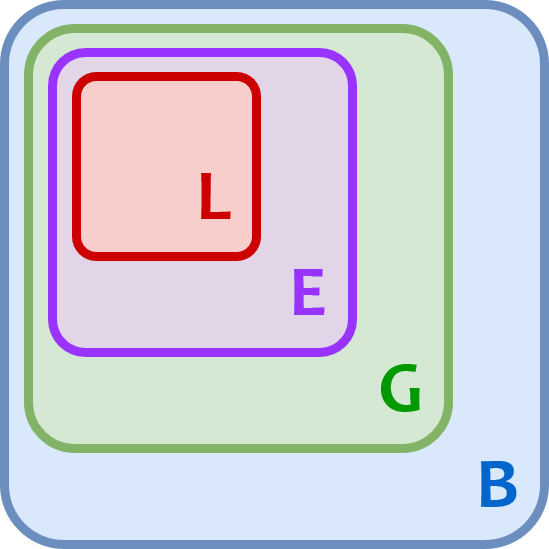

# Функции

!!! info "Автор(ы)"

    - [Овсянникова Александра](https://github.com/alexmorphine)
    - [Чернов Илья](https://github.com/ch3rn0v/)

## Что такое функция в Python

В общем случае функцией можно назвать набор связанных инструкций, которые выполняют определенную задачу. Функции во всех языках программирования помогают:

- структурировать код и улучшить читаемость;
- переиспользовать код;
- уменьшать количество мест, в которых можно ошибиться, при копировании и вставке кода.

Таким образом, функция — это инструмент композиции кода. Однажды определив набор инструкций, можно многократно использовать его, в том числе и как составную часть других функций.

В Python функции можно разделить на три типа:

- [x] встроенные ([список built-in функций](https://docs.python.org/3/library/functions.html));
- [x] именованные (определенные пользователем при помощи `def`);
- [x] анонимные (`lambda`-функции).

^^Все^^ функции являются объектами типа `function`.

Мы уже использовали встроенные функции, например:

- `print()` – вывод данных на экран;
- `str()` – создание объектов строкового типа;
- `type()` – определение типа объекта.

Ими можно пользоваться как черным ящиком, который принимает что-то на вход и творит свою магию. О том, что готовые функции ожидают получить, написано в документации вместе с описанием принципа работы.

!!! info "Совет"

    После разбора лекции советуем открыть [документацию `print()`](https://docs.python.org/3/library/functions.html#print), например, и разобраться с подробностями работы.

Очевидно, стандартные функции дают лишь базовый инструментарий. Реализовать более сложную логику можно самостоятельно.

### Пример

Представим, что необходимо находить количество корней квадратного уравнения — это легко можно реализовать на Python!

```python linenums="1"
def count_roots(a, b, c):

    d = b ** 2 - 4 * a * c

    if d == 0:
        return "один"

    elif d < 0:
        return "нет корней"

    else:
        return "два"
```

## Именованные функции

### Определение

Определение функции позволяет ^^создать объект^^ функции. После определения к функции можно будет обратиться по заданному имени и получить результат её работы.

В Python существует особый синтаксис определения именованных функций:

1. в начале — ключевое слово `def`;
2. название функции

    существуют правила и рекомендации по именованию функций:

    - **правила**:

        - название не может начинаться с числа;
        - можно использовать нижнее подчеркивание `_`, цифры и буквы;

    - **рекомендации**:

        - `snake_case`: в названии только буквы нижнего регистра, слова разделяются `_`;
        - название функции должно быть уникальным;

3. круглые скобки и, опционально, параметры внутри (о них ниже);
4. двоеточие, переход на новую строку;
5. тело функции, выделенное отступом — набор инструкций, который «выполняет работу».

Код в Python организован в блоки и именно отступы дают понять, где у блоков начало и конец. Блоки могут быть вложенными. Все тело функции должно располагаться минимум в одном отступе от начала строк.

```python linenums="1"
def название_функции(позиционные, *доп_позиционные, именованные, **доп_именованные_параметры):
    инструкция 0
    инструкция 1
    ....
    инструкция N
```

Напишем простейшую функцию, которая будет печатать две фразы:

```python linenums="1"
# Первым делом — def
# далее — имя функции "print_theme"
# после — круглые скобки, сейчас пустые. Потом : и переход на новую строку
def print_theme():

    # Тело функции из двух вызовов print(), оба с одинаковым отступом
    print("Лекция про функции!")
    print("Тело кончилось")
```

### Вызов

После определения функции появляется возможность к ней обращаться (вызывать). Делается это просто: указывается имя функции, круглые скобки и, опционально, аргументы в них.

```python linenums="1"
# Выше была определена print_theme, ее и вызовем.
print_theme()
```
```
Лекция про функции!
Тело кончилось
```

### Возвращаемое значение

Все функции в Python имеют одно и только одно возвращаемое значение. Если в теле функции отсутствует ключевое слово `return`, возвращаемое значение всегда будет `None`.

```python linenums="1"
# Определим функцию, которая принимает на вход x
def add_two(x):

    # Переменная result — сумма x и 2
    result = x + 2

    # «Наружу» возвращается полученное значение
    return result
```

!!! question "Возможно ли вернуть несколько значений?"

    Это возможно, если упаковать несколько значений в одно значение-контейнер. В Python контейнеры могут быть следующих типов:

    - список (например, `[1, 2, 3]`)
    - кортеж (`(1, 2, 3)`)
    - словарь (`{"key_one": 1, "key_two": 2, "key_three": 3}`)
    - объект класса (см. раздел [объекты и классы](./object_class_method.md))

    Таким образом, возвращается одно значение, а содержать в себе оно может несколько других.

Возвращение значения означает, что его можно использовать вне функции, например, присвоить полученное значение переменной. Давайте посмотрим, что возвращает `print_theme()` и `add_two()`:

```python linenums="1"
# Присвоим результат выполнения функции переменной и посмотрим, что в ней
from_print_theme = print_theme()
print(from_print_theme is None)
```
```
Лекция про функции!
Тело кончилось
True
```

Как видите, несмотря на отсутствие `return` в коде функции, она действительно возвращает `None`.

Теперь посмотрим на `add_two()`, где возвращаемое значение задано нами:

```python linenums="1"
# add_two при вызове ожидает получить число: сложим 2 и 2
from_add_two = add_two(2)
print(from_add_two)
```
```
4
```

### Множественные `return`'ы

В теле функции можно указать `return` несколько раз. Выражения в Python вычисляются по очереди, и возвращаемое значение функции определяется первым вычисленным выражением, содержащем `return` (а если `return` отсутствует в теле функции, возвращается `None`).

Покажем это на примере функции, умножающей нечетные числа на 2 и делящей четные числа пополам.

```python linenums="1"
def change_num(num):
    if num % 2 == 0:
        return num / 2

    return num * 2


print(change_num(4))
print(change_num(5))
```
```
2
10
```

Выражение в строке 3 будет выполнено в случае, если выполняется условие из строки 2. При этом происходит выход из функции, и следующие выражения в ее теле уже не исполнятся при этом вызове. Поэтому нет необходимости писать `else`:

```python linenums="1"
def change_num_2(num):
    if num % 2 == 0:
        return num / 2
    else:  # Это избыточно
        return num * 2  # Появляется лишний уровень вложенности
```

Функция `change_num_2` эквивалентна `change_num`, но содержит лишний уровень вложенности. Знание о том, что после первого `return` происходит выход из функции, позволяет избежать лишней вложенности.

## Пространства имен и области видимости

Чуть выше была определена `add_two()`, внутри которой инициализировалась переменная `result`. Значение этой переменной нельзя получить, обратившись к ней вне функции.

```python linenums="1"
# Ошибочка!
# Конструкция try-except перехватывает исключение NameError
# и не дает программе перестать работать из-за возникновения этой ошибки
try:
    print(result)
except NameError as ne:
    print(ne)
```
```
name 'result' is not defined
```

Потому что функции обладают своим пространством имен: переменные, которые определены внутри, не видны извне. Однако, функция может получать доступ к переменным, которые определены снаружи. Давайте опишем чуть более формально.

В Python объектам можно давать имя и обращаться к ним по нему. Эти имена организованы в пространства имен или namespace. Инициализация переменной добавляет в namespace название объекта. Namespace — набор имен определенных на текущий момент объектов. Представьте себе `dict`, где ключом является строка, а значением — ссылка на объект. Область видимости определяет, переменные из каких пространств имен сейчас доступны. Разберем, как и где Python ищет объекты, к которым обращаются (этот процесс называется name resolution).

Namespace и области видимости можно разделить на несколько типов:

- локальные (Local) — локальные переменные функции, данная область существует до тех пор, пока функция не завершит работу после вызова;
- локальные пространства могут быть вложены друг в друга, в таком случае область уровня `N` (Enclosing) содержит «более глубокую» `N + 1`. Поиск имени, вызванного на уровне `N`, начинается с локального namespace этого уровня и продвигается «наружу», то есть на уровни выше;
- глобальные (Global) — все объекты, определенные на уровне скрипта;
- встроенные (Built-in) — namespace содержит все встроенные объекты (функции, исключения и т. д.), поиск в нем осуществляется последним.

{ width="400" }

Если имя не было найдено даже на уровне Built-in, будет выброшено исключение `NameError`.

```python linenums="1"
z = "name"

def foo():

    # В foo не определена своя z, но она найдется в глобальной области
    print(z)

    a = 10
    b = -5

    def bar():

        # bar успешно напечатает a, при этом значение будет найдено в namespace foo
        # Как думаете, где находится print?
        # В built-in, то есть самой "внешней" области
        print(a)

        # Создадим переменную b внутри bar
        b = 20

        # Будет напечатано 20, так как поиск увенчается успехом в локальном namespace
        print(b)

        c = 30

    bar()

    # Если раскомментировать следующую строку, будет ошибка
    # print(c)
    # Потому что foo не знает ничего про внутренности bar

    # Что будет напечатано, если раскомментировать следующую строку?
    # print(b)

foo()
```
```
name
10
20
```

!!! tip "Совет"

    Хотим заметить, что нужно быть аккуратными при использовании вложенных функций и следить за тем, где и какие переменные определены. В рамках курса не советуем так делать, чтобы не запутаться. Единственное исключение — декораторы, описанные ниже.

### Замыкания

[Замыкание](https://ru.wikipedia.org/wiki/%D0%97%D0%B0%D0%BC%D1%8B%D0%BA%D0%B0%D0%BD%D0%B8%D0%B5_(%D0%BF%D1%80%D0%BE%D0%B3%D1%80%D0%B0%D0%BC%D0%BC%D0%B8%D1%80%D0%BE%D0%B2%D0%B0%D0%BD%D0%B8%D0%B5)) ([Closure](https://en.wikipedia.org/wiki/Closure_(computer_programming))) — это функция, объявленная в теле внешней функции, и использующая значения из области видимости внешней функции.

Замыкания удобно использовать для динамического создания функций.

```python linenums="1"
def make_adder(arg1):
    def _adder(arg2):
        return arg1 + arg2


    return _adder


add_three = make_adder(3)
print(add_three(2))
```
```
5
```

### Каррирование

[Каррирование](https://ru.wikipedia.org/wiki/%D0%9A%D0%B0%D1%80%D1%80%D0%B8%D1%80%D0%BE%D0%B2%D0%B0%D0%BD%D0%B8%D0%B5) ([Currying](https://en.wikipedia.org/wiki/Currying)) — это превращение функции от нескольких аргументов в последовательность функций от одного аргумента. 

В Python реализован менее строгий аналог каррирования. С помощью функции [`partial`](https://docs.python.org/3/library/functools.html#functools.partial) можно получить функцию от меньшего числа аргументов, но не обязательно одного. Рассмотрим пример.

```python linenums="1"
from functools import partial


def adder(arg1, arg2):
    return arg1 + arg2


add_three = partial(adder, 3)
print(add_three(2))
```
```
5
```

Первым аргументом в `partial` передается функция. А далее через запятую можно передать от 0 до N аргументов, которые требуется зафиксировать, где N — это число аргументов исходной функции. Возвращаемое значение `partial` — это функция от N - x аргументов, где x — это число аргументов, переданных в `partial` (и таким образом зафиксированных).
Передавать в `partial` только функцию и 0 аргументов можно, но не имеет смысла (получится функция от N аргументов, которая и была изначально). Если же зафиксировать все N аргументов, то на выходе получится функция от нуля аргументов (если это была чистая функция, результат будет эквивалентен константе).

Важно заметить, что `partial` сохраняет порядок аргументов. Поэтому при определении функции лучше в начале ставить аргументы, значения которых реже будут меняться.

!!! tip "Совет"

    Легко увидеть аналогию с примером замыкания, и действительно, в некоторых случаях использование `partial` дает тот же результат, но проще и потому предпочтительнее.

### Чистые функции

[Чистой функцией](https://ru.wikipedia.org/wiki/%D0%A7%D0%B8%D1%81%D1%82%D0%BE%D1%82%D0%B0_%D1%84%D1%83%D0%BD%D0%BA%D1%86%D0%B8%D0%B8) ([pure function](https://en.wikipedia.org/wiki/Pure_function)) называют функцию, одновременно обладающую следующими свойствами:

- является детерминированной;
- не имеет побочных эффектов.

Детерминированность означает, что возвращаемое значение всегда одинаково для одних и тех же значений аргументов.

Отсутствие побочных эффектов означает, что вызов функции не изменит ничего за пределами своей локальной области видимости. Сохранение возвращаемого функцией значения в переменную происходит за рамками функции, поэтому не нарушает ее чистоты.

```python linenums="1"
external_dict = {"arg": 2}


def fn1(arg):
    return arg * external_dict["arg"]


def fn2(arg):
    external_dict["arg"] = 3
    return arg * 2


def fn3(arg1, arg2):
    return arg1 * arg2


print(fn1(2))
print(fn2(2))
print(fn1(2))
print(fn3(2, 2))
```

!!! question "Какие из вызванных выше функций являются чистыми?"

!!! question "Подумайте, какие значения будут напечатаны?"

Функция `fn1` не имеет побочных эффектов, но она не детерминирована потому что зависит от `external_dict`. Поэтому она не чистая.

Функция `fn2` детерминирована, но она имеет побочный эффект — изменяет содержимое `external_dict`. Поэтому она не чистая.

Функция `fn3` детерминирована и не имеет побочных эффектов, поэтому она чистая.

Функция `print` тоже была вызвана. Является ли она чистой? Вывод на печать — это побочный эффект, поэтому нет.

Вывод у кода выше будет такой:

```
4
4
6
4
```

Вызов `fn2` изменил содержимое `external_dict`, поэтому второй вызов `fn1` дал результат, отличный от первого вызова.

Чистые функции гораздо проще понять при чтении кода и гораздо проще отлаживать, поэтому по возможности стоит все функции делать чистыми.

## Параметры

Наша функция `add_two()` или, например, `type()` ожидают, что на вход будут переданы какие-то аргументы для успешной работы, а вот `print()` можно вызвать и с ними, и с пустыми скобками. В начале лекции был представлен скелет функции, сейчас разберем, что же находится в скобках.

Для начала немного формализма:

- при определении функции в скобках пишутся параметры, которые функция может принять;
- при вызове функции в скобках указываются аргументы, которые задают значения параметров внутри функции.

То есть происходит отображение: аргументы, с которыми вызывается функция $\Rightarrow$ значения параметров.

Переменные с названиями параметров могут быть использованы внутри тела функции, как будто их значения известны.

### Позиционные параметры

Позиционные параметры выглядят как перечисленные внутри скобок названия переменных, используемых внутри функции:

```python linenums="1"
# В данном случае заданы два позиционных параметра
def foo(arg1, arg2):
    print(arg1, arg2)
```

Данный тип параметров характеризуется следующим:

- идут первыми после открытых скобок, все именованные строго после них;
- важен порядок: отображение аргументов в параметры будет последовательным;
- при вызове функции все аргументы, которые ожидает функция, должны быть переданы (иначе откуда Python возьмет значения? вот именно!)

Разберем пример, который суммирует два числа:

```python linenums="1"
# В данном случае заданы два позиционных параметра
def two_var_sum(var1, var2):

    # Функция возвращает вычисленное значение суммы
    return abs(var1) + var2

# Порядок важен!
print(two_var_sum(-1, 2), two_var_sum(2, -1))

# Можно явно задавать переменные при вызове, в таком случае порядок не играет роли
# Указывается название параметра и значение после =
print(two_var_sum(var2=2, var1=-1))
```
```
3 1
3
```

А что, если количество входных переменных очень большое или вы заранее не знаете, сколько аргументов будет передано при вызове? Например, вам нужно сложить не 2 числа, а 102? В Python есть специальный синтаксис со звездочками. После позиционных аргументов можно указать `list`, элементами которого станут неограниченное количество переданных позиционных аргументов.

Синтаксис: `имя_функции([поз_0, ..., поз_N,] [*поз_список]): ...`; `[]` в данном случае обозначают необязательность.

```python linenums="1"
# В этом примере сразу используется синтаксис со *: список, куда попадут все переданные позиционные аргументы, тут называется args, а других позиционных параметров нет совсем
def many_arg_sum(*args):

    # Функция возвращает вычисленное значение суммы
    return sum(args)

many_arg_sum(1, 2, 3, 4, 5, 6)
```
```
21
```

!!! tip "Совет"

    Лучше передавать все в списках или векторах (о которых будет позже)

### Именованные параметры

Данные параметры имеют значения по умолчанию.  

Синтаксис: `имя_функции([поз_0, ..., поз_N,] [*поз_список], [им_0=значение_0, ..., им_K=значение_K], [**им_словарь]): ...`

Характеризуются следующим:

- в определении идут строго после позиционных параметров;
- в определении дано значение по умолчанию через `=` после имени;
- при вызове необязательно указывать значения, тогда будет использовано значение по умолчанию.

```python linenums="1"
# Тут есть один позиционный параметр name и один именованный phrase
def hello(name, phrase="Привет"):

    print(f"{phrase}, {name}")

# Передавать значения аргументов можно, сохраняя исходный порядок
hello("Саша", "Приветствую")

# Или указывая названия параметров (в таком случае порядок можно менять)
hello(phrase="Здарова", name="Игорь")

# Если не указать значение именованного параметра, используется что по умолчанию
hello("Вася")
```
```
Приветствую, Саша
Здорова, Игорь
Привет, Вася
```

Аналогично позиционным аргументам, если необходимо передать множество именованных параметров, используется синтаксис со звездочками, но в данном случае их две, а не одна. Если такой синтаксис использован, все переданные именованные аргументы, кроме определенных явно, попадут в `dict`, указанный после `**`:

```python linenums="1"
def congrats(today, everyone=False, **names_dates_mapper):
    """
    Функция может поздравляет людей
    Args:
        today (str): сегодняшняя дата
        everyone (bool): флаг, нужно ли поздравить всех
        names_dates_mapper (dict): отображение имя: дата
    """

    if everyone:
        print("Happy Birthday!")

    else:
        for name, date in names_dates_mapper.items():
            if date[-5:] == today[-5:]:
                print(f"Happy Birthday, {name}")


congrats("2021-09-17", Paul="2001-03-08", Lena="1997-01-31", Mark="1997-09-17")
```
```
Happy Birthday, Mark
```

!!! question "Что это за комментарий в тройных кавычках внутри функции?"

    Это один из общепринятых способов написания [docstring](https://www.python.org/dev/peps/pep-0257/) — документации по функции.

## Анонимные функции

Функции, определенные при помощи `def`, имеют название, по которому их можно вызвать, но также существуют и анонимные или неименованные функции. Такие функции могут быть определены при помощи оператора `lambda`. Он позволяет задать входные и выходные данные. Самостоятельно можете почитать [документацию](https://docs.python.org/3/reference/expressions.html#grammar-token-lambda-expr).

```python
# синтаксис анонимных функций простой
lambda [арг_0, ..., арг_N]: выражение
```

В определении `выражение` — это возвращаемое значение анонимной функции, например:

```python linenums="1"
lambda x: abs(x)

lambda num, div=2: "нет" if num % div else "да"
```
```
<function __main__.<lambda>(num, div=2)>
```

В примере выше `lambda`-функции были только созданы в моменте, но не вызваны. Можно сказать, что мы их определили (как с `def`), но не воспользовались и сразу потеряли к ним доступ.

Для удобства можно присвоить объект функции переменной, и по этому имени к ней обращаться:

```python linenums="1"
# Сохранили функцию в переменную check_div
check_div = lambda num, div=2: "нет" if num % div else "да"

# Вызов такой же, как в случае с именованной функцией
print(check_div(3), check_div(5, 5))

# Возможен вызов и без сохранения в переменную
print((lambda x: abs(x))(-120))
```
```
нет да
120
```

В отличии от именованной, анонимная функция может иметь только одно выражение.

Данные функции стоит применять, когда нужна одноразовая функция или требуется отложить вычисления. Пример с одноразовой функцией:

```python linenums="1"
list(map(lambda x: x**2, [1, 2, 3]))
```
```
[1, 4, 9]
```

Здесь используется встроенная функция `map`. Она получает на вход функцию и список элементов, вызывает функцию для каждого элемента, результат такого вызова сохраняет в список и возвращает список результатов. В примере выше на вход подан список из трех элементов и анонимная функция, которая возводит аргумент в квадрат.

А вот пример с отложенными вычислениями:

```python linenums="1"
perform_computation = lambda: 2 ** 10_000_000 / 2 ** 10_000_000
perform_computation()
```
```
1.0
```

В данном случае на первой строке вычисления уже определены, но еще не сделаны. И только на второй строке, где происходит вызов, вычисляется выражение из тела `lambda`-функции. Обратите внимание, что `lambda`-функция может вовсе не иметь аргументов, как и именованная.

## Декораторы

Функции в Python являются [объектами первого класса](https://ru.wikipedia.org/wiki/Объект_первого_класса). Кроме прочего, это значит, что их можно передавать в другие функции в качестве аргументов, и отдавать в качестве возвращаемых значений. Благодаря этому возможно создавать декораторы. Декоратор — это функция, расширяющая возможности другой функции.

### Пример

```python linenums="1"
import time


# На вход декоратор принимает параметр func — оборачиваемую функцию
def time_decorator(func):

    # Внутри определена функция, которую декоратор вернет в качестве результата своей работы
    # `wrapped()` будет засекать, за сколько выполняется функция `func()`
    def wrapped(*args, **kwargs):
        start = time.time()

        # Все аргументы, которые примет `wrapped()`, передаются в func
        result = func(*args, **kwargs)

        end = time.time()
        print(f"Прошло {end - start} секунд")

        # Результат работы func, каким бы он ни был, возвращается
        return result

    # Обратите внимание, что возвращаемое значение — именно объект function: после имени нет круглых скобок
    # Если бы они были, возвращался бы результат выполнения `wrapped()`, так как это вызов функции

    return wrapped
```

Выше была определена функция `many_arg_sum()`, давайте засекать, сколько она работает:

```python linenums="1"
# Cохраним обернутую функцию (помним, декоратор возвращает функцию) в переменную
# Обратите внимание, что на вход декоратору передается объект самой функции, а не результат ее работы.
many_arg_sum = time_decorator(many_arg_sum)

# Поведение функции поменялось, а код вызова — нет
summed = many_arg_sum(10, 0, -120, 333)
```
```
Прошло 1.9073486328125e-06 секунд
```

Отлично, но можно добавить так называемый ^^синтаксический сахар^^: вместо присваивания значения над определением функции можно указать специальный символ `@`, после которого указывается название декоратора:

```python linenums="1"
@time_decorator
def primitive_exponentiation(x, power=5):
    result = 1
    for p in range(power):
        result *= x
    return result

powered = primitive_exponentiation(10)
```
```
Прошло 4.0531158447265625e-06 секунд
```

Использование синтаксического сахара с `@` и указанием имени декоратора над функцией аналогично вызову

```python linenums="1"
primitive_exponentiation = time_decorator(primitive_exponentiation)
```

## Что узнали из лекции

- что такое функции и зачем их применять
- как определить функцию (инструкция `def`)

    ```python
    def название_функции(параметры):
        тело функции
        <return возвращаемые_значения>
    ```

- отличия позиционных параметров от именованных:
    - порядок указания - сначала позиционные, потом именованные
    - значения по умолчанию у именованных позволяют не указывать их при вызове
- синтаксис со звездочками для получения заранее неизвестного числа позиционных (`*some_list`) и именованных (`**some_dict`) аргументов
    - в `*some_list` стоит одна `*`: эта конструкция для получения неограниченного количества позиционных/неименованных аргументов
    - в `**some_dict` две `*`: все именованные аргументы, явно не указанные среди параметров, попадут туда
- что может возвращать функция при помощи `return`
    - `return` обозначает выход из функции и передачу «наружу» результата работы
    - в `return` можно перечислять несколько возвращаемых значений через запятую
- что такое декораторы и как они работают, щепотку синтаксического сахара с `@`
    - использование декоратора эквивалентно сохранению результата вызова функции-декоратора с аргументом в виде оборачиваемой функции `stupid_power = time_decorator(stupid_power)`
