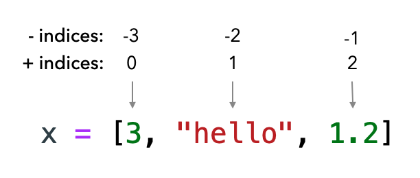

# Списки и циклы

!!! info "Автор(ы)"

    - [Котенков Игорь](https://github.com/stalkermustang)
    - [Baushenko Mark](https://github.com/e0xextazy)

## Введение в списки объектов

В предыдущих лекциях операции были с малым количеством переменных. Для каждого блока логики или примера кода вводилось 3-5 объектов, над которыми осуществлялись некоторые операции. Но что делать, если объектов куда больше? Скажем, необходимо хранить информацию об учащихся класса – пусть это будет рост, оценка по математике или что-либо другое. Крайне неудобно будет создавать и хранить 30 отдельных переменных. А если ещё и нужно посчитать среднюю оценку в классе!

```python linenums="1"
average_grade = petrov_math + kosareva_math + zinchenko_math + kotenkov_math # + ...
average_grade = average_grade / 30
```

Такой код к тому же получается крайне негибким: если количество студентов, как и их состав, изменится, то нужно и формулу переписать, так ещё и делитель – в нашем случае 30 – изменять.

Часто в программах приходится работать с большим количеством однотипных переменных. Специально для этого придуманы ^^массивы^^ (по-английски array). В Python их ещё называют ^^списками^^ (list). В некоторых языках программирования эти понятия отличаются, но не в Python. Список может хранить переменные ^^разного^^ типа. Также списки называют [«контейнерами»](https://ru.wikipedia.org/wiki/Контейнер_(программирование)), так как они хранят какой-то набор данных. Для создания простого списка необходимо указать квадратные скобки или вызвать конструктор типа (`list` – это отдельный тип, фактически такой же, как `int` или `str`), а затем перечислить ^^объекты через запятую^^:

```python linenums="1"
# разные способы объявления списков
first_list = []
second_list = list()
third_list = list([1,2, "stroka", 3.14])
fourth_lust = [15, 2.2, ["another_list", False]]

print(type(second_list), type(fourth_lust))
print(first_list, fourth_lust)
```
```bash
<class 'list'> <class 'list'>
[] [15, 2.2, ['another_list', False]]
```

!!! info "Между тем"

    Хоть список и хранит переменные разного типа, но так делать без особой необходимости не рекомендуется – можно запутаться и ошибиться в обработке объектов списка. В большинстве других языков программирования массив может хранить только объекты одного типа.

    Для хранения сложных структур (скажем, описание студента – это не только оценка по математике, но и фамилия, имя, адрес, рост и так далее) лучше использовать классы – с ними познакомимся в будущем. А ещё могут пригодиться ^^кортежи^^, или `tuple`.

    <p align="center"><iframe width="560" height="315" src="https://www.youtube.com/embed/h3X4vjAdHUw" title="YouTube video player" frameborder="0" allow="accelerometer; autoplay; clipboard-write; encrypted-media; gyroscope; picture-in-picture" allowfullscreen></iframe>

Теперь можно один раз создать список и работать с ним как с единым целым. Да, по-прежнему для заведения оценок студентов придётся разово их зафиксировать, но потом куда проще исправлять и добавлять! Рассмотрим пример нахождения средней оценки группы, в которой всего 3 учащихся, но к ним присоединили ещё 2, а затем – целых 5:

```python linenums="1"
# базовый журнал с тремя оценками
math_journal = [3, 3, 5]

# добавим новопришедших студентов
math_journal.append(4)
math_journal.append(5)

# и сразу большую группу новых студентов
math_journal.extend([2,3,4,5,5])

print(f"{math_journal = }")

# найдём среднюю оценку как сумму всех оценок, делённую на их количество
avg_grade = sum(math_journal) / len(math_journal)
print(f"{avg_grade = }")
```
```bash
math_journal = [3, 3, 5, 4, 5, 2, 3, 4, 5, 5]
avg_grade = 3.9
```

В коде выше продемонстрировано сразу несколько важных аспектов:

1. добавлять по одному объекту в конец списка можно с помощью метода списка `append()`.
2. метод `append()` принимает в качестве аргумента один объект.
3. слияние нескольких списков (конкатенация, прямо как при работе со строками) осуществляется командой `extend()` (расширить в переводе с английского).
4. для списков определена функция `len()`, которая возвращает целое число `int` – количество объектов в списке.
5. функция `sum()` может применяться к спискам для суммирования всех объектов (если позволяет тип – то есть для `float`, `int` и `bool`; попробуйте разобраться самостоятельно, как функция работает с последним указанным типом).
6. для методов `append()` и `extend()` не нужно приравнивать результат выполнения какой-то переменной – изменится сам объект, у которого был вызван метод (в данном случае это `math_journal()`);
7. списки в Python ^^упорядочены^^, то есть объекты сами по себе места не меняют, и помнят, в каком порядке были добавлены в массив.

!!! info "О методе"

    В тексте выше встречается термин ^^метод^^, который, быть может, не знаком. По сути метод есть такая же ^^функция^^, о которых говорили ранее, но она принадлежит какому-то объекту с определенным типом. Не переживайте, если что-то непонятно – про функции и методы поговорим подробно в ближайших лекциях!

    `print()`, `sum()` – функции, они существуют сами по себе;
    `append()`, `extend()` – методы объектов класса `list`, не могут использоваться без них.

## Индексация списков

Теперь, когда стало понятно, с чем предстоит иметь дело, попробуем усложнить пример. Как узнать, какая оценка у третьего студента? Всё просто – нужно воспользоваться ^^индексацией^^ списка:

```python linenums="1"
# базовый журнал с пятью оценками
math_journal = [1, 2, 3, 4, 5]

third_student_grade = math_journal[3]
print(third_student_grade)
```
```bash
4
```

И снова непонятный пример! Давайте разбираться:

- для обращения к `i`-тому объекту нужно в квадратных скобках указать его индекс;
- ^^индекс^^ в Python начинается ==c нуля== – это самое важное и неочевидное, здесь чаще всего случаются ошибки;
- поэтому `[3]` обозначает взятие 4-й оценки (и потому выводится `4`, а не `3`);
- всего оценок 5, но так как индексация начинается с нуля, то строчка `math_journal[5]` выведет ошибку – доступны лишь индексы `[0, 1, 2, 3, 4]` для взятия (так называется процедура обращения к элементу списка по индексу – взятие по индексу).

<figure markdown>
  
  <figcaption>
  Пример списка из трёх объектов. Сверху показаны их индексы, включая отрицательные
  </figcaption>
</figure>

Также в `Python` существуют отрицательные индексы (-1, -2 ...). Они отсчитывают объекты списка, начиная с конца. Так как нуль уже занят (под первый объект), то он не используется.

```python linenums="1"
# базовый журнал с пятью оценками
math_journal = [1, 2, 3, 4, 5]

# возьмём последнюю оценку
last_grade = math_journal[-1]
print(f"Последняя оценка: {last_grade}")

# а теперь – предпоследнюю
prev = math_journal[-2]
print(f"Предпоследняя оценка: {prev}")

# конечно, взятие по индексам можно использовать в ранее разобранном синтаксисе

if math_journal[-1] < math_journal[-2]:
    math_journal[-1] += 1
    print("Последняя оценка меньше предпоследней. Натянем студенту?")
else:
    math_journal[-2] = 2
    print("Последний студент сдал очень хорошо, на его фоне предпоследний просто двоечник!")
```
```bash
Последняя оценка: 5
Предпоследняя оценка: 4
Последний студент сдал очень хорошо, на его фоне предпоследний просто двоечник!
```

Всё это важно не только для грамотного оперирования конкретными объектами, но и следующей темы.

## Срезы

Срезы, или slices – это механизм обращения сразу к нескольким объектам списка. Для создания среза нужно в квадратных скобках указать двоеточие, слева от него – индекс начала среза (по умолчанию `0`, можно не выставлять) ^^включительно^^, справа – границу среза ^^не включительно^^ (пустота означает «до конца списка»). Может показаться нелогичной такая разнородность указания границ, но на самом деле она безумно удобна – особенно вместе с тем, что индексация начинается с нуля. Быстрее объяснить на примере:

```python linenums="1"
# базовый журнал с пятью оценками
math_journal = [1, 2, 3, 4, 5]

# как взять первые 3 оценки?
first_3_grades = math_journal[:3]
print(f"{first_3_grades = }")

# как взять последние две оценки?
last_2_grades = math_journal[-2:]
print(f"{last_2_grades = }")

# сделаем срез на 4 оценки, начиная со второй (с индексом 1)
start_index = 1
some_slice = math_journal[start_index : start_index + 4]
print(f"{some_slice = }")

# возьмём столько объектов из начала, сколько объектов в some_slice
yet_another_slice = math_journal[:len(some_slice)]

# а вот так можно проверить, попадает ли объект в список
print(f"Верно ли, что единица входит в some_slice? {1 in some_slice}")
print(f"Верно ли, что единица входит в yet_another_slice? {1 in yet_another_slice}")
```
```bash
first_3_grades = [1, 2, 3]
last_2_grades = [4, 5]
some_slice = [2, 3, 4, 5]
Верно ли, что единица входит в some_slice? False
Верно ли, что единица входит в yet_another_slice? True
```

!!! info "Между тем"

    Можно сделать пустой срез, и тогда Python вернет пустой список без объектов. Можете проверить сами:
    `["1", "2", "3"][10:20]`

Давайте проговорим основные моменты, которые ^^крайне важно понять^^:

- так как индексация начинается с нуля (значение по умолчанию) и правая граница не включается в срез, то берутся объекты с индексами `[0, 1, 2]`, что в точности равняется трём первым объектам;
- срез `[-2:]` указывает на то, что нужно взять все объекты до конца, начиная с предпоследнего;
- значения в срезе могут быть ^^вычислимы^^ (и задаваться сколь угодно сложной формулой), но должны оставаться ^^целочисленными^^;
- если нужно взять `k` объектов, начиная с `i`-го индекса, то достаточно в качестве конца среза указать `k+i`;
- для проверки вхождения какого-либо объекта в список нужно использовать конструкцию `x_obj in some_list`, которая вернет `True`, если массив содержит `x_obj`, и `False` в ином случае;
- самый простой способ сделать копию списка - это сделать срез по всему объекту: `my_list[:]`. Однако будьте внимательны – в одних случаях копирование происходит полностью (по значению), а в некоторых сохраняются ссылки (то есть изменив один объект в скопированном списке вы измените объект в исходном). Связано это с типом объектов (mutable/immutable), подробнее об этом будет рассказано в следующей лекции. В общем, если работаете с простыми типами (`int`/`str`), то срез вернёт копию, и её изменение не затронет исходный список. Однако для хранения новых данных нужна память, поэтому при копировании десятков миллионов объектов можно получить ошибку, связанную с нехваткой памяти.

## Кортеж (tuple)

Выше уже упоминалось о таком понятии как кортеж. Можете спросить: зачем нужны кортежи, если они так сильно похожи на списки? Чтобы больше не возникало подобных вопросов давайте сравним их!

- Главным отличием является то, что кортежи это ^^неизменяемый тип данных^^. То есть в процессе выполнения программы можно быть уверенным, что значения внутри кортежа останутся ^^неизменными^^. И из этого свойства вытекает множество других.
- Кортеж имеет ^^меньше размер^^, чем список. Это связано с тем, что список – изменяемый объект и ему нужно хранить дополнительную информацию о выделенной памяти.

  ```python linenums="1"
  a = (1, 2, 3, 4, 5, 6)
  b = [1, 2, 3, 4, 5, 6]

  print(a.__sizeof__())
  print(b.__sizeof__())
  ```
  ```bash
  36
  44
  ```

- Возможность использовать кортежи в качестве ключей словаря:

  ```python linenums="1"
  d = {(1, 1, 1) : 1}
  print(d)
  ```
  ```bash
  {(1, 1, 1): 1}
  ```

  ```python linenums="1"
  d = {[1, 1, 1] : 1}
  print(d)
  ```
  ```bash
  Traceback (most recent call last):
    File "", line 1, in
      d = {[1, 1, 1] : 1}
  TypeError: unhashable type: 'list'
  ```

Чтобы создать пустой кортеж, можно воспользоваться двумя конструкциями:

```python linenums="1"
a = tuple() # С помощью встроенной функции tuple()
a = () # С помощью литерала кортежа
```

Давайте для примера создадим кортеж с 1 элементом:

```python linenums="1"
a = ("s")
print(a)
```
```bash
's'
```

Получилась строка. Но как же так? Давайте попробуем по-другому:

```python linenums="1"
a = ("s", )
print(a)
```
```bash
('s',)
```

Оказывается все дело в запятой. Сами по себе ^^скобки ничего не значат^^, точнее значат то, что внутри них находится одна инструкция, которая может быть отделена пробелами, переносом строк и т.д.

Можно подумать что у кортежей одни только плюсы, но это не так. Количество операций, которые можно применять над кортежами меньше, чем у списков. Это опять же связано с тем, что они неизменяемые. Получается что над кортежами можно применять ^^все операции над списками, которые не изменяют список^^: сложение, умножение на число, методы `index()`, `count()` и некоторые другие операции.

## Циклы

До сих пор в примерах хоть и обращались к разным объектам, добавляли и меняли их, всё ещё не было рассмотрено взаимодействие сразу с несколькими. Попробуем посчитать, сколько студентов получили оценку от 4 и выше. Для этого интуитивно кажется что нужно ^^пройтись по всем оценкам от первой до последней^^, сравнить каждую с четверкой. Для прохода по списку, или ^^итерации^^, используются ^^циклы^^.
Общий синтаксис таков:

```python linenums="1"
example_list = list(...)
for item in example_list:
    <> блок кода внутри цикла (аналогично блоку в if)
    ... что-то сделать с item
    <>
```

Здесь `example_list` – это некоторый итерируемый объект. Помимо списка в Python существуют и другие итерируемые объекты, но пока будем говорить о массивах.

Этот цикл работает так: указанной ^^переменной `item` присваивается первое значение из списка^^, и выполняется ^^блок кода^^ внутри цикла (этот блок, напомним, определяется отступом. Он выполняется весь от начала отступа и до конца, как и было объяснено в пятой лекции). Этот блок ещё иногда называют ^^телом цикла^^. Потом переменной `item` присваивается следующее значение (второе), и так далее. Переменную, кстати, можно называть как угодно, необязательно `item`.

^^Итерацией^^ называется каждый ^^отдельный проход^^ по телу цикла. Цикл всегда повторяет команды из тела цикла несколько раз. Два примера кода ниже аналогичны:

```python linenums="1"
math_journal = [3, 4, 5]
counter = 0

for cur_grade in math_journal:
    if cur_grade >= 4:
        counter += 1

print(f"Всего хорошистов и отличников по математике {counter} человека")
```
```bash
Всего хорошистов и отличников по математике 2 человека
```

```python linenums="1"
math_journal = [3, 4, 5]
counter = 0

cur_grade = math_journal[0]
if cur_grade >= 4:
    counter += 1

# не забываем менять индекс с 0 на 1, так как каждый раз берётся следующий элемент
cur_grade = math_journal[1]
if cur_grade >= 4:
    counter += 1

# и с единицы на двойку
cur_grade = math_journal[2]
if cur_grade >= 4:
    counter += 1

print(f"Всего хорошистов и отличников по математике {counter} человека")
```
```bash
Всего хорошистов и отличников по математике 2 человека
```

Понятно, что первый кусок кода обобщается на любой случай – хоть оценок десять, хоть тысяча. Второе решение не масштабируется, появляется ^^много одинакового кода, в котором легко ошибиться^^ (не поменять индекс, к примеру).

Движемся дальше. Так как каждый элемент списка закреплен за конкретным индексом, то в практике часто возникают задачи, логика которых завязана на индексах. Это привело к тому, что появилась альтернатива для итерации по списку. Функция `range` принимает аргументы, аналогичные срезу в списке, и возвращает итерируемый объект, в котором содержатся целые числа (индексы). Так как аргументы являются аргументами функции, а не среза, то они соединяются запятой (как `print(a, b)` нескольких объектов). Если подан всего один аргумент, то нижняя граница приравнивается к нулю. Посмотрим на практике, как сохранить номера (индексы) всех хорошо учащихся студентов:

```python linenums="1"
math_journal = [4, 3, 4, 5, 5, 2, 3, 4]
good_student_indexes = []

for student_index in range(len(math_journal)):
    curent_student_grade = math_journal[student_index]
    if curent_student_grade >= 4:
        good_student_indexes.append(student_index)

print(f"Преуспевающие по математике студенты находятся на позициях: {good_student_indexes}")
```
```bash
Преуспевающие по математике студенты находятся на позициях: [0, 2, 3, 4, 7]
```

В примере `student_index` принимает последовательно все значения от `0` до `7` включительно. `len(math_journal)` равняется `8`, а значит, восьмёрка сама не будет включена в набор индексов для перебора. На каждой итерации `curent_student_grade` меняет своё значение, после чего происходит проверка. Если бы была необходимость пробежаться только по студентам, начиная с третьего, то нужно было бы указать `range(2, len(math_journal))` (двойка вместо тройки потому, что индексация с нуля, ведь мы перебираем индексы массива).

Давайте немного модифицируем предыдущий пример:

```python linenums="1"
math_journal = [4, 3, 4, 5, 5, 2, 3, 4]
good_student_indexes = []

for student_index, student_grade in enumerate(math_journal):
    if student_grade >= 4:
        good_student_indexes.append(student_index)

print(f"Преуспевающие по математике студенты находятся на позициях: {good_student_indexes}")
```
```bash
Преуспевающие по математике студенты находятся на позициях: [0, 2, 3, 4, 7]
```

В данном случае итерации происходят по объекту `enumerate(math_journal)`. Метод `enumerate()` возвращает итератор состоящий из `tuple`, где каждый `tuple` содержит пару состоящую из ^^индекса элемента^^ и ^^самого элемента^^. В отличии от предыдущего примера, здесь не нужно получать оценку студента по его индексу (строчка номер 5), а можно ^^напрямую^^ ее использовать из цикла `for`. Если предполагается работать одновременно и с индексами списка, и с его элементами, то метод `enumerate()` – ^^отличный способ сделать код чище^^!

Выше описаны основные концепции обращения со списками. Их крайне важно понять и хорошо усвоить, без этого писать любой код будет безумно сложно. Скопируйте примеры к себе в тетрадку, поиграйтесь, поменяйте параметры цикла и проанализируйте изменения.

## List comprehensions

Некоторые циклы настолько просты, что занимают 2 или 3 строчки. Помимо прочего ещё и быстрее исполняются. Как пример – привести список чисел к списку строк:

```python linenums="1"
# грубый вариант
inp_list = [1,4,6,8]
out_list = []

for item in inp_list:
    out_list.append(str(item))

# list comprehension
out_list = [str(item) for item in inp_list]
print(out_list)
```
```bash
['1', '4', '6', '8']
```

Две части кода идентичны за вычетом того, что нижняя – с непонятной конструкцией в скобках – короче. Python позволяет в рамках одной строки произвести какие-либо простые преобразования (помним, что `str()` – это вызов функции!). Фактически самый частый пример использования – это паттерн «применение функции к каждому объекту списка».

## Что узнали из лекции

- `list` – это ^^объект-контейнер, который хранит другие объекты разных типов^^; запись происходит упорядочено и последовательно, а каждому объекту присвоен ^^целочисленный номер, начиная с нуля^^;
- для добавления одного объекта в `list` нужно использовать метод объекта `list` – `append()`, а для расширения списка сразу на несколько позиций пригодится `extend()`;
- проверить, входит ли объект в список, можно с помощью конструкции `obj in some_list`;
- индексы ^^могут быть отрицательными^^: `-1`, `-2` ... В таком случае нумерация начинается от последнего объекта;
- можно получить часть списка, сделав ^^срез^^ с помощью конструкции `list[start_index : end_index]`, при этом объект на позиции `end_idnex` не будет включён в возвращаемый список (т.е. ^^срез работает не включительно по правую границу^^);
- В зависимости от задачи – иногда удобнее и правильнее использовать `tuple` вместо `list`;
- часто со списками используют ^^циклы, которые позволяют итерироваться по объектам массива^^ и выполнять произвольную логику в рамках отделенного отступом блока кода;
- для итерации по индексам можно использовать `range()`, а для итерации по элементам с индексами – `enumerate()`;
- простые циклы можно свернуть в ^^list comprehension^^, и самый частый паттерн для такого преобразования – это ^^применение некоторой функции к каждому объекту^^ списка (если `x` это функция, то синтаксис будет таков: `[x(item) for item in list])`).
