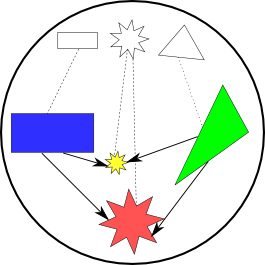
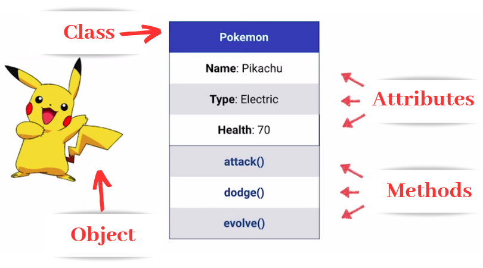

# Объекты, классы и методы

!!! info "Автор(ы)"

    - [Котенков Игорь](https://github.com/stalkermustang)

## ООП: Объектно-Ориентированное Программирование

Что же такое объектно-ориентированное программирование? Судя по названию, ключевую роль здесь играют объекты, на которые ориентируется дальнейший процесс программирования. Если взглянем на реальный мир, то для нас он предстанет в виде множества объектов, обладающих определенными свойствами, взаимодействующих между собой и вследствие этого изменяющимися. Эта привычная для взгляда человека картина мира была перенесена в программирование. Python - это объектно-ориентированный язык программирования, и ^^всё в нем является объектами^^.

^^Объект^^ - это набор данных и инструкций в памяти компьютера, в том числе:

- тип объекта
- данные, формирующие объект (контент внутри него)
- методы

<figure markdown>
  { width="250" align=left }
  <figcaption>
  Так можно проиллюстрировать соотношение «класс - объекты». Сверху указаны общие прототипы (прямоугольник, звезда, треугольник), снизу - уникальные экземпляры, со своим цветом и деталями
  </figcaption>
</figure>

Как определить тип уже знаем. И с объектами на самом деле знакомы с самого начала - ведь даже целочисленная переменная `5`, имеющая `type(5) = int`, представляет собой объект.

!!! info "Напомним"

    Методы - это те же функции, только существующие не сами по себе, а являющиеся частью класса.

```python linenums="1"
example_list = list(["что-то", "с"])
print(f"Метод append имеет тип {example_list.append}")

# вот так можно вызвать метод, изменяя сам экземпляр класса
example_list.append("чем-то")

# а вот так можно обратиться к атрибуту конкретного объекта
attr_value = example_list.__doc__
print(f"Значение атрибута: {attr_value}")
```
```bash
Метод append имеет тип <built-in method append of list object at 0x7f1a38036e40>
Значение атрибута: Built-in mutable sequence.

If no argument is given, the constructor creates a new empty list.
The argument must be an iterable if specified.
```

`list` - это класс, и в первой строчке кода выше создается ^^объект, или экземпляр класса^^ `example_list`. Он хранит свой набор данных (контент). Метод `append` общий для всех списков, однако меняет только конкретный экземпляр. Обратим внимание: этот метод ничего не возвращает, он меняет сам объект и его контент. Не все методы работают схожим образом, и придется запоминать принцип работы самых распространенных методов. К примеру, сложение чисел или строк внутри Python также осуществляется с помощью методов, однако это не меняет саму переменную, как было рассказано в более ранних лекциях:

```python linenums="1"
# создадим два объекта класса int
a = 3
b = int(4)

# неявно вызовем метод сложения
a + b
# проверим, что содержимое объектов не изменилось
print(f"{a = }, {b = }")
```
```bash
a = 3, b = 4
```

Конкретно в данном случае логика работы обусловлена свойствами `mutable`/`immutable` объектов, о чём также упоминалось в одной из предшествующих лекций. `int` неизменяем, и потому при вызове метода сложения возвращает новый объект - ведь самого себя изменить не получится. `list` же может меняться, и `append` меняет содержимое `inplace`.

<figure markdown>
  { width="450" }
  <figcaption>
  Другой житейский пример - по одному чертежу (классу) можно построить разные (но похожие!) дома, в которых разные семьи, убранство, разные обои
  </figcaption>
</figure>

## Определение классов

Давайте попробуем создать свой первый класс:

```python linenums="1"
# определим классы
class List:
    def __init__(self, initial_content = None):
        # указывать в виде значения по умолчанию mutable-объекты неправильно
        if initial_content is None:
            initial_content = []
        self.content = initial_content

    def append(self, new_element):
        # изменение производится inplace, с заменой собственного контента
        self.content = self.content + [new_element]

class Int:
    def __init__(self, value):
        self.value = value

    def add(self, second_value):
        # изменение не производится, создается новый объект и он же возвращается
        return Int(self.value + second_value.value)

# воспроизведем примеры кода выше для List
example_list = List(["что-то", "с"])
print(f"{example_list.content = }")

example_list.append("чем-то")
print(f"{example_list.content = }")
print(f"{type(example_list) = }")

# и для Int
a = Int(3)
b = Int(4)

a.add(b)
print(f"После простого сложения: {a.value = }, {b.value = }")

c = a.add(b)
print(f"После записи в переменную результата: {c.value = }")
```
```bash
example_list.content = ['что-то', 'с']
example_list.content = ['что-то', 'с', 'чем-то']
type(example_list) = <class '__main__.List'>
После простого сложения: a.value = 3, b.value = 4
После записи в переменную результата: c.value = 7
```

Что важно заметить и отметить в этом примере:

1. Как объявить класс? С помощью ключевого слова `class`, указания названия класса (таким образом создается новый тип данных) и перечисления методов:

    ```python
    class ИмяКласса:
        <код_тела_класса>
    ```

2. Обязательно определить метод `__init__`. Это метод, вызываемый при создании нового объекта класса и отвечающий за определение его контента. В нем через запятую, как и в обычной функции, перечислить необходимые переменные и, по возможности, их значения по умолчанию.
3. Каждый метод должен первым аргументом принимать ^^экземпляр объекта^^ (по соглашению он называется `self`). При этом при вызове метода Python автоматически подставит сам объект, делать это руками не нужно. По сути под капотом происходит следующее:

    ```python linenums="1"
    # вызываем метод класса - не объекта! - и передаем первым аргументом объект,
    # который при обычных обстоятельствах будет записан в self
    result = Int.add(Int(3), Int(4))
    print(f"{result.value}")
    ```
    ```bash
    7
    ```

4. Атрибутом называется переменная, хранящаяся в экземпляре класса.
5. В рамках методов атрибуты объекта доступны с использованием ключевого слова `self`. К примеру, `self.data`.
6. Вне методов атрибуты доступны у экземпляров через точку: `some_object.attr_name`.
7. Для создания объекта класса нужно указать имя класса (типа) и передать аргументы: `Int(3)` - как раз оно.
8. Методы как могут возвращать что-либо (в том числе новый объект того же класса), так и ничего не возвращать.

В заключение еще одна картинка, иллюстрирующая суть класса, экземпляра, атрибутов и методов:

<figure markdown>
  { width="450" }
  <figcaption>
  Что это за покемон?
  </figcaption>
</figure>

## Пример использования для хранения состояние

Допустим, есть некоторая среда, заданная состоянием, и есть объекты, существующие в этой среде, как-то взаимодействующие между собой (и со средой). Есть набор функций, который осуществляет эти взаимодействия. Тогда удобно ввести некоторый объект `system`  класса `System`, который хранит эту информацию, и передавать его как параметр в методы расчета чего-либо (никакой конкретной логики тут не заложено, не пытайтесь понять, за что отвечает `alpha` и прочие переменные - пример абстрактный):

```python linenums="1"
# класс системы, с ее параметрами и состоянием
class System:
    def __init__(self, param_vector, alpha, gamma, multiplier = 2.0, energy = 0.0):
        self.param_vector = param_vector
        self.alpha = alpha
        self.gamma = gamma
        self.multiplier = multiplier
        self.energy = energy

        # начальное состояние
        self.system_state = [
            (alpha - gamma) * multiplier * param
            for param
            in self.param_vector
        ]

    def first_action(self, object):
        # взаимодействие с одним объектом: увеличение энергии, изменение состояния системы
        self.gamma -= object.energy
        self.energy += object.energy
        self.system_state = [param - self.alpha * self.energy for param in self.system_state]

    def second_action(self, list_of_object):
        # взаимодействие с несколькими объектами - увеличение их энергии
        for obj in list_of_object:
            obj.energy += self.gamma * self.multiplier

class Object:
    def __init__(self, energy = 10.0):
        # объект хранит только один атрибут
        self.energy = energy

# симуляция одного цикла в системе
def one_system_cycle(system: System, objects = None):
    if objects is not None:
        system.second_action(objects)
        # убираем один последний объект
        objects = objects[:-1]
    else:
        objects = [Object(val) for val in range(5)]
        for obj in objects:
            system.first_action(obj)
    return objects

params = [1.0, 3.0, 4.15, 0.0]
alpha = 5
gamma = 0.18
system = System(params, alpha, gamma, energy = 10)

# изначально объектов нет, они появятся после первого цикла
objects = None

for cycle_num in range(1, 4):
    print(f"Состояние системы на итерации {cycle_num}: {system.system_state}.", end="\t")
    objects = one_system_cycle(system, objects)
    print(f"Всего объектов: {len(objects)}", end="\t")

    total_object_energy = sum([obj.energy for obj in objects])
    print(f"Суммарная энергия объектов: {total_object_energy}")
```
```bash
Состояние системы на итерации 1: [9.64, 28.92, 40.00600000000001, 0.0].	Всего объектов: 5	Суммарная энергия объектов: 10
Состояние системы на итерации 2: [-340.36, -321.08, -309.994, -350.0].	Всего объектов: 4	Суммарная энергия объектов: -72.56
Состояние системы на итерации 3: [-340.36, -321.08, -309.994, -350.0].	Всего объектов: 3	Суммарная энергия объектов: -114.84
```

Обратите внимание на то, что функция `one_system_cycle` не возвращает `system` - ведь прямо во время итераций меняем ее состояние, и в последующие моменты времени эти изменения сохраняются, то есть состояние остается. Таким образом, эту систему (среду) - а именно объект, экземпляр класса `System` - как параметр ^^можно передавать в десятки функций, и каждая из них будет видеть актуальное состояние^^.

## Что узнали из лекции

- объекты одного класса отличаются между собой атрибутами, которые придают уникальности;
- методы классов позволяют описывать логику взаимодействия, обновлять состояние;
- для объявления класса нужно определить как минимум один метод `__init__`;
- классы без методов можно использовать как удобное хранилище разнородной информации о схожих объектах (описать разных студентов и их оценки).

Это далеко не все, что можно написать по теме классов и объектов, однако это тот необходимый минимум, что потребуется для ознакомления. Больше примеров и деталей можно найти, например, по ссылкам:

- [пример с несколькими взаимодействующими объектами](https://younglinux.info/oopython/ooprogramm)
- [что такое наследование и зачем оно нужно](https://younglinux.info/oopython/inheritance)
