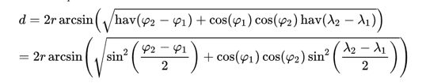

# Синтаксический сахар

!!! info "Автор(ы)"

    - [Kosarevsky Dmitry](https://github.com/dKosarevsky)

## Введение

**Синтаксический сахар** — это синтаксис, который позволяет разработчикам писать код проще, «сладким» способом. Следовательно, такой способ даёт роскошь не знать, как работает система под капотом. Синтаксический сахар связан не только с Python, подробнее по [ссылке](https://ru.wikipedia.org/wiki/%D0%A1%D0%B8%D0%BD%D1%82%D0%B0%D0%BA%D1%81%D0%B8%D1%87%D0%B5%D1%81%D0%BA%D0%B8%D0%B9_%D1%81%D0%B0%D1%85%D0%B0%D1%80).

Раннее уже были изучены некоторые способы использования синтаксического сахара в Python, такие как:

- [декораторы](./functions.md#_17)
- [генераторы](./functions.md#_19)
- [контекстные менеджеры](./conditional_comparison.md#_5)
- [f-строки (f-strings)](./variable_types_output.md#_4)
- [списковое включение или генератор списков (list comprehensions)](./list_loop.md#list-comprehensions)

Важно понимать и другие варианты применения такого функционала изучаемого языка.

## Магические методы (Magic Methods)

**Магические методы** (иногда их ещё называют специальными методами) — это методы с предопределенными именами, характеризующимися двойным подчеркиванием в начале и в конце - `__init__`. Они являются «магическими», потому что эти методы вызываются косвенно, их не нужно вызывать их напрямую, все делается за кулисами. Например, когда создаётся экземпляр класса `x = MyClass()`, Python выполнит необходимые вызовы `__new__` и `__init__`.

Пример:

```python linenums="1"
greet = "Hello, Python ODS!"

print(greet)
```
```bash
Hello, Python ODS!
```

```python linenums="1"
greet.__repr__()
```
```bash
"'Hello, Python ODS!'"
```

Как видно из примера, метод `__repr__()` тесно связан с известной функцией `print()`. Вот еще несколько примеров:

```python linenums="1"
list_example = ["test", "baz", 8]

"test" in list_example
len(list_example)
print(list_example)
list_example == []
list_example[2]
```
```bash
True
3
['test', 'baz', 8]
False
8
```

```python linenums="1"
list_example.__contains__("test")
list_example.__len__()
list_example.__repr__()
list_example.__eq__([])
list_example.__getitem__(2)
```
```bash
True
3
"['test', 'baz', 8]"
False
8
```

В этом разделе не будут подробно рассматриваться магические методы, если есть желание узнать больше о них - можно заглянуть в [документацию](https://docs.python.org/3.11/reference/datamodel.html).

Являются ли магические методы синтаксическим сахаром? Да!

## Генератор словарей (dict-comprehension)

```python linenums="1"
{key: value for key, value in d.items()}
```
```bash

```

## Операторы присваивания

```python linenums="1"
a += 1
# эквивалент кода: a = a + 1
```

## Операторы сравнения

```python linenums="1"
1 < x < 10
# эквивалент кода: 1 < x and x < 10
```

## Тернарный оператор

```python linenums="1"
x = something if condition else otherthing
```

## Большие числа

Для удобства чтения большие числа можно записывать с использованием символа нижнего подчёркивания.

```python linenums="1"
number = 1_000_000_000_000
number2 = 1000000000000
print(number == number2)
```
```bash
True
```

## Ellipsis (многоточие)

Python имеет специальный встроенный одноэлементный объект под названием `Ellipsis` (многоточие). Если вывести три точки или слово `Ellipsis` в интерактивной оболочке Python, результаты будут следующими:

```python linenums="1"
...
```
```bash
Ellipsis
```

```python linenums="1"
Ellipsis
```
```bash
Ellipsis
```

Этот простой предмет кажется незаметным, но если правильно его использовать, он может облегчить нашу жизнь. Рассмотрим три общих сценария, в которых можно использовать `Ellipsis`.

### `Ellipsis` — это заполнитель для ненаписанного кода

При разработке нового модуля обычно определяются некоторые функции или классы, но не реализуются сразу. Потому что хочется только определить, что нужно написать в будущем, и не слишком заботимся о деталях реализации на раннем этапе. В таком сценарии `Ellipsis` — наш лучший друг:

```python linenums="1"
def create_lecture():
    ...


class Lecture:
    ...
```

Как показано выше, можно просто использовать `Ellipsis` в качестве заполнителя для функции или класса.

Вообще говоря, хорошей практикой программирования является то, что сначала проектируются необходимые функции или классы, а потом реализуются. Поэтому такой способ может помочь нашему уму ясно видеть всю структуру и не зацикливаться сразу на деталях.

Кстати, ключевое слово `pass` также можно использовать в качестве заполнителя в Python:

```python linenums="1"
def create_lecture():
    pass


class Lecture:
    pass
```

Решить, какой из них использовать, можно исходя из личных предпочтений.

### Использование `Ellipsis` в `NumPy`, чтобы опустить размеры

`NumPy` — важная библиотека Python для Data Science. `Ellipsis` полезно при работе с многомерными массивами в `NumPy`.

Например, если есть трёхмерная матрица и необходимо разделить её, то есть как минимум три способа как сделать это:

```python linenums="1"
import numpy as np

A = np.random.rand(2, 3, 2)
print(A)
```
```bash
[[[0.992417   0.9530508 ]
  [0.56965073 0.30738159]
  [0.7711779  0.11873405]]

 [[0.95767839 0.82798645]
  [0.31408532 0.22584154]
  [0.22445472 0.62915576]]]
```

```python linenums="1"
print(A[:, :, 1])
```
```bash
[[0.9530508  0.30738159 0.11873405]
 [0.82798645 0.22584154 0.62915576]]
```

```python linenums="1"
print(A[..., 1])
```
```bash
[[0.9530508  0.30738159 0.11873405]
 [0.82798645 0.22584154 0.62915576]]
```

```python linenums="1"
print(A[Ellipsis, 1])
```
```bash
[[0.9530508  0.30738159 0.11873405]
 [0.82798645 0.22584154 0.62915576]]
```

Как показано выше, использование `Ellipsis` (трёх точек) является наиболее экономичным способом разделения многомерной матрицы. Потому что это требует наименьшего набора текста. Время программистов — деньги, не так ли?

### Использование `Ellipsis` для подсказки типа

Подсказки типов были новым функционалом Python версии 3.5. На основе [PEP 484](https://www.python.org/dev/peps/pep-0484/) `Ellipsis` имеет особое значение для этого функционала.

С одной стороны однородные кортежи произвольной длины могут быть выражены с помощью одного типа и `Ellipsis`, например, `Tuple[int, ...]`.

С другой стороны можно объявить возвращаемый тип вызываемого объекта без указания сигнатуры вызова, заменив `Ellipsis` (три точки) на список аргументов:

```python linenums="1"
def partial(func: Callable[..., str], *args) -> Callable[..., str]:
    # тело функции
```

`Ellipsis` — интересный синтаксический сахар в Python. Его удобно использовать в некоторых сценариях.

## Морж-оператор (walrus-operator)


Каждая новая версия Python добавляет в язык новые функции. Для Python 3.8 самым большим изменением было добавление выражений присваивания. В частности, оператор `:=` дает новый синтаксис для присваивания переменных в середине выражений. Такой оператор в просторечии известен как морж-оператор.

Поговорим о том, как:

- определить морж-оператора и понять его значение
- понимать варианты использования морж-оператора
- избегать повторяющегося кода с помощью морж-оператора
- конвертировать код, использующий морж-оператора, в код, использующий другие методы присваивания и наоборот
- понимать влияния на обратную совместимость при использовании морж-оператора
- использовать соответствующий стиль в выражениях присваивания

!!! note "Замечание"

    Для корректной работы морж-оператора требуется Python 3.8 или более поздней версии.

### Основы морж-оператора

Оператор `:=` официально известен как оператор выражения присваивания. Во время ранних дискуссий его назвали оператором моржа, потому что синтаксис `:=` напоминает глаза и бивни лежащего на боку моржа. Также иногда можно увидеть, что оператор `:=` называют «оператор двоеточие равно» (colon equals operator). Еще одним термином, используемым для выражений присваивания, являются именованные выражения.

Чтобы получить первое представление о том, что такое выражения присваивания, можно поэкспериментировать со следующим кодом:

```python linenums="1"
walrus = False
print(walrus)
```
```bash
False
```

В примере выше показан традиционный оператор присваивания, в котором переменной `walrus` присваивается значение `False`.

```python linenums="1"
print(walrus := True)
```
```bash
True
```

Затем, используется выражение присваивания, чтобы присвоить значение `True` для `walrus`. В обоих случаях можно ссылаться на присвоенные значения, используя имя переменной `walrus`.

Между двумя типами присваиваний, рассмотренными выше с переменной `walrus`, есть тонкая, но важная разница. Выражение присваивания возвращает значение, а традиционное присваивание — нет.

В этих примерах можно увидеть еще один важный аспект операторов моржа. Оператор `:=` не делает ничего такого, что было бы невозможно без него. С помощью оператора моржа можно лишь делать определенные конструкции более удобными и иногда можно более четко передать цель кода.

Общее представление о том, что такое оператор `:=` и что он может делать получено. Это оператор, используемый в выражениях присваивания, который может возвращать присваиваемое значение, в отличие от традиционных операторов присваивания.

!!! warning "Внимание"

    Один из принципов разработки, лежащий в основе оператора walrus, заключается в том, что не существует идентичных контекстов кода, в которых были бы допустимы как оператор присваивания, использующий оператор `=`, так и выражение присваивания, использующее оператор `:=`. Например, невозможно выполнить простое присваивание с помощью оператора walrus:

    ```python linenums="1"
    walrus := True
    ```
    ```bash
      File "<stdin>", line 1
        walrus := True
               ^
    SyntaxError: invalid syntax
    ```

    В большинстве случаев можно добавить круглые скобки `()` вокруг выражения присваивания, чтобы сделать код валидным:

    ```python linenums="1"
    (walrus := True)
    ```

    Однако такая конструкция не имеет большого смысла, т.к. удобнее воспользоваться оператором `=`. При этом запись традиционного оператора присваивания `=` внутри таких скобок не допускается.

### Варианты использования морж-оператора

В этом разделе рассмотрим несколько примеров, где морж-оператора может упростить код. Общая тема всех этих примеров заключается в том, чтобы избегать различных видов повторения:

- повторные вызовы функций могут сделать код медленнее
- повторяющиеся операторы могут затруднить сопровождение кода
- повторяющиеся вызовы итераторов могут сделать код чрезмерно сложным
- увидим, как морж-оператор может помочь в каждой из этих ситуаций

**Отладка**

Возможно, один из лучших вариантов использования морж-оператора — отладка сложных выражений. Допустим, стоит задача найти расстояние между двумя точками на земной поверхности. Один из способов сделать это — использовать [формулу `гаверсинуса`](https://ru.frwiki.wiki/wiki/Formule_de_haversine):



`ϕ` представляет широту, а `λ` представляет долготу каждого местоположения. Чтобы продемонстрировать эту формулу, можно рассчитать расстояние между Москвой (55,45° с. ш., 37,36° в. д.) и Ванкувером (51,3° с. ш., 0,7° з. д.) следующим образом:

```python linenums="1"
from math import asin, cos, radians, sin, sqrt

rad = 6371  # приблизительный радиус Земли в километрах

# Расположение Москвы и Лондона
ϕ1, λ1 = radians(55.45), radians(37.36)
ϕ2, λ2 = radians(51.3), radians(-0.7)

# Расстояние между Москвой и Лондоном
dist = 2 * rad * asin(
    sqrt(
        sin((ϕ2 - ϕ1) / 2) ** 2
        + cos(ϕ1) * cos(ϕ2) * sin((λ2 - λ1) / 2) ** 2
    )
)
print(dist)
```
```bash
2533.3259714914857
```

Как можно увидеть, расстояние от Москвы до Лондона составляет чуть более 2500 километров.

Теперь предположим, что нужно перепроверить реализацию и посмотреть, насколько члены `гаверсинуса` влияют на конечный результат. Можно скопировать и вставить часть из основного кода, чтобы оценить его отдельно. Однако также можно использовать оператор `:=`, чтобы дать имя интересующему подвыражению:

```python linenums="1"
dist = 2 * rad * asin(
    sqrt(
        (ϕ_hav := sin((ϕ2 - ϕ1) / 2) ** 2)
        + cos(ϕ1) * cos(ϕ2) * sin((λ2 - λ1) / 2) ** 2
    )
)
print(ϕ_hav)
```
```bash
0.0013109950744640937
```

Преимущество использования морж-оператора здесь заключается в том, что одновременно можно вычислять значение итогового значения и отслеживаете значение `ϕ_hav`. Это позволяет подтвердить, что не было допущено никаких ошибок во время отладки.

**Списки и словари**

Списки — это мощные структуры данных в Python, которые часто представляют собой ряд связанных атрибутов. Точно так же словари используются во всем Python и отлично подходят для структурирования информации.

Иногда при настройке таких структур данных приходится выполнять одну и ту же операцию несколько раз. В качестве первого примера вычислим некоторую базовую описательную статистику списка чисел и сохраним их в словаре:

```python linenums="1"
numbers = [12, 0, 18, 3, 2, 7, 3, 1]

data_structure = {
    "длина": len(numbers),
    "сумма": sum(numbers),
    "среднее": sum(numbers) / len(numbers),
}
print(data_structure)
```
```bash
{'длина': 8, 'сумма': 46, 'среднее': 5.75}
```

Важно обратить внимание, что и сумма, и длина списка чисел вычисляются дважды. В этом простом примере последствия не так уж плохи, но если бы список был больше или вычисления были бы более сложными, вероятно захотелось бы оптимизировать такой код. Для этого можно сначала переместить вызовы функций из определения словаря:

```python linenums="1"
numbers = [12, 0, 18, 3, 2, 7, 3, 1]

num_length = len(numbers)
num_sum = sum(numbers)

data_structure = {
    "длина": num_length,
    "сумма": num_sum,
    "среднее": num_sum / num_length,
}
print(data_structure)
```
```bash
{'длина': 8, 'сумма': 46, 'среднее': 5.75}
```

Переменные `num_length` и `num_sum` используются только для оптимизации вычислений внутри словаря. Используя морж-оператор, эту роль можно сделать более понятной:

```python linenums="1"
numbers = [12, 0, 18, 3, 2, 7, 3, 1]

data_structure = {
    "длина": (num_length := len(numbers)),
    "сумма": (num_sum := sum(numbers)),
    "среднее": num_sum / num_length,
}
print(data_structure)
```
```bash
{'длина': 8, 'сумма': 46, 'среднее': 5.75}
```

`num_length` и `num_sum` теперь определены внутри определения описания. Это явный намёк на то, что эти переменные используются только для оптимизации этих вычислений и больше не используются позже.

!!! note "Замечание"

        Область видимости переменных `num_length` и `num_sum` одинакова в примере с морж-оператором и в примере без него. Это означает, что в обоих примерах переменные доступны после определения описания.

        Несмотря на то, что оба примера функционально очень похожи, преимущество использования выражений присваивания заключается в том, что оператор `:=` сообщает о назначении этих переменных как одноразовые оптимизации.

## Заключение

Как видно, синтаксический сахар облегчает жизнь программистам, и часто они даже не замечают или даже не знают, что используем его, но в любом случае всегда полезно знать, как он работает в деталях, потому что рано или поздно придётся глубже понять как работает та или иная вещь, чтобы успешно решать сложные задачи.

## Что узнали из лекции

- Магические методы
- Генератор словарей
- Операторы присваивания
- Операторы сравнения
- Тернарный оператор
- Большие числа
- `Ellipsis`
- Морж-оператор (walrus-operator)
