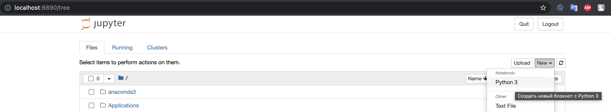
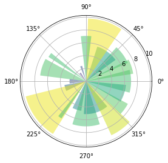

# Установка необходимых инструментов и настройка среды

!!! info "Автор(ы)"

    - [Котенков Игорь](https://github.com/stalkermustang)
    - [vvssttkk](https://github.com/vvssttkk)

## Установка Git

[`Git`](https://github.com/git-guides) – система контроля версий. Этот инструмент часто используется для совместной разработки программ (и не только!) группой людей, каждый из которых работает над своей отдельной проблемой. Так, например, этот курс был создан с помощью `Git`, и каждый автор работал с отдельной копией, создавая набор лекций. А затем все копии собрались в одну книгу, которую читаете. Пара учебных материалов по работе с git:

- [погружение в git](https://gitimmersion.com/);
- [наиболее часто используемые советы и рекомендации по git](https://github.com/git-tips/tips);
- [git-scm](https://git-scm.com/docs/gittutorial).

### Инструкция для Ubuntu

Эта часть подойдет также для всех "родственных" систем: Debian, Linux Mint, Deepin Linux (который можно встретить на ноутбуках компании Huawei, к примеру) и многие другие системы, использующие менеджер пакетов `apt`.

Вероятнее всего, git уже предустановлен. Это можно подтвердить следующей командой

```bash
git --version
```

Если получите вывод, аналогичный `git version 2.36.2`, то он уже установлен

### Инструкция для macOS

Для дальнейшей работы необходимо установить менеджер пакетов - `brew`. [По ссылке](https://brew.sh/index_ru) найдете инструкцию и более детальное описание, чем является `brew`. Необходимо выполнить в терминале (который доступен как приложение на экране со всеми приложениями – просто начните вводить `term` и поиск подскажет верный вариант) команду:

```bash
/bin/bash -c "$(curl -fsSL https://raw.githubusercontent.com/Homebrew/install/HEAD/install.sh)"
```

!!! attention "Внимание"

    Скорее всего, для выполнения этой команды, нужно задействовать команду `sudo`, это вполне нормальная история.

Для установки самого git выполнить

```bash
brew install git
```

Проверить что git установлен, выполните

```bash
git --version
```

К примеру, если получите что-то вида `git version 2.36.2` -- всё прошло успешно.

### Инструкция для Windows `(доделать)`


### Копирование репозитория курса

К примеру, дабы скопировать репозиторий этой книги, нужно зайти на его страницу в [GitHub](https://github.com/) (имеются и другие подобные системы) курса.

[Перейти в репозиторий курса](https://github.com/open-data-science/pycourse){ .md-button .md-button--primary }

Затем найдите кнопку с текстом `< > Code` и кликните по ней. В открывшемся окне убедитесь, что выбрана вкладка `HTTPS`, а не `SSH` или `GitHub CLI`. Скопируйте предложенную ссылку (это такое же, если скопировать ссылку вкладки браузера). После зайдите в терминал в нужную директорию и выполните

``` bash
git clone https://github.com/open-data-science/pycourse.git
```

После чего появится директория `pycourse/` (символом `/` обозначают что это директория, а не файл). Это можно увидеть через команду `ls` (только для Ubuntu и macOS).

Для того, чтобы зайти в директорию, потребуется выполнить команду (change directory, сменить директорию)

```bash
cd pycourse/
```

## Установка Python

Быстрее всего (как минимум в символах и сразу для всех платформ) рассказать как установить Python, то нужно зайти на официальный сайт => навести курсором на вкладку «Downloads» и выбрать нужную платформу (Ubuntu, macOS) => скачать релиз с нужной версией (для начала советуем начать стабильную версию, к примеру, `3.10.6` на момент когда эта лекция пишется)

[Перейти на сайт python](https://www.python.org/){ .md-button .md-button--primary }

!!! attention "Между тем"

    Python для Ubuntu и macOS предустановлен, но он довольно старый, ещё 2 версия, которая уже как не поддерживается.

## Установка виртуального окружения `(доделать)`


## Установка Jupyter

Для установки классического Jupyter Notebook выполнить

```bash
pip install notebook
```

Для запуска

```bash
jupyter notebook
```

По перейдите по одной из ссылок (если не перекинула само), в которых есть слово `token` – они начинаются с `http://localhost` или `http://127.0.0.1`. В браузере откроется страница с обзором папки, из которой был запущен `Jupyter Notebook`. Если в дальнейшем хотите хранить все свои результаты в другой директории, то перед запуском команды с помощью уже указанной инструкции в терминале `cd <путь/до/директории>` перейдите к ней.

Для создания нового файла – блокнота, как его еще называют (почему? узнаете в следующей лекции) – кликните по кнопке `New` в правом верхнем углу, а затем – по `Python 3` (возможно будет какая-нить приставка, это штатно).

<figure markdown>
  
  <figcaption>
  Таким образом можно создать новый файл с кодом
  </figcaption>
</figure>

Для завершения проверки скопируйте код ниже в тетрадку в браузере, а затем нажмите ++ctrl+enter++ (++command+return++ для macOS) (это заставит код выполниться, подробнее дальше в курсе). Если увидите график - то все в полном порядке!

``` py
import numpy as np
import matplotlib.pyplot as plt
%matplotlib inline

# Fixing random state for reproducibility
np.random.seed(19680801)

# Compute pie slices
N = 20
θ = np.linspace(0.0, 2 * np.pi, N, endpoint=False)
radii = 10 * np.random.rand(N)
width = np.pi / 4 * np.random.rand(N)
colors = plt.cm.viridis(radii / 10.)

ax = plt.subplot(111, projection="polar")
ax.bar(θ, radii, width=width, bottom=0.0, color=colors, alpha=0.5)

plt.show()
```



Не переживайте, этот код не нужно разбирать сейчас – просто убеждаемся, что все работает согласно задумке. Если что-то не так, пересмотрите все ли сделали согласно инструкции; если да и не воспроизводится, то задавайте вопрос в [канале курса](https://opendatascience.slack.com/archives/CEH3VJCRJ)

### jupyterlab

Модернизированная версия Jupyter Notebook смахивающая в какой-то мере на полноценную среду разработки (с тёмной темой), где одновременно можно работать с несколькими файлами, а не в отдельных вкладках как в классическом.

Для установки

```bash
pip install jupyterlab
```

Запустить

```bash
jupyter-lab
```

Горячо рекомендуем сразу использовать его, ну или сразу привыкать работать с IDE JetBrains PyCharm, VSCode и т.д.

### colab

[Collaboratory](https://colab.research.google.com) или Colab от Google Research – размещенный Jupyter – который используется для написания и запуска преимущественно Python из браузера, то есть вычисления происходят целиком и полностью в облаке, требуется лишь наличие стабильного интернета. Также имеются бесплатные GPU и TPU, но c ограничениями как и сами аппаратные ресурсы: не сможете создавать проекты, требующие большого объема вычислений. Также можно делиться созданными блокнотами (Jupyter Notebooks) по необходимости.

Более детально советуем ознакомиться с [Google Colab – Краткое руководство](https://isolution.pro/ru/t/google-colab/google-colab-quick-guide/google-colab-kratkoe-rukovodstvo).
