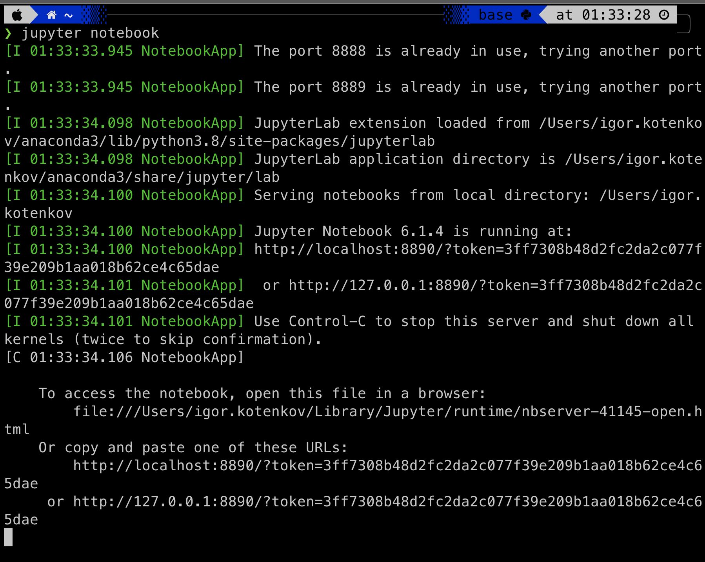

# Установка необходимых инструментов и настройка среды

!!! info "Автор(ы)"

    - [Котенков Игорь](https://github.com/stalkermustang)
    - [vvssttkk](https://github.com/vvssttkk)

## Установка Python

Быстрее всего (как минимум в символах и сразу для всех платформ) рассказать как установить Python, потребуется

- [x] зайти на [официальный сайт Python](https://www.python.org/)
- [x] во вкладке «Downloads» выбрать нужную платформу (Linux, macOS, Windows)
- [x] скачать релиз (для начала советуем использовать стабильную версию, к примеру, `3.10.6` на момент когда эта лекция пишется)

!!! attention "Между тем"

    Python для Linux и macOS предустановлен, но он довольно старый, ещё 2 версия, которая уже как не поддерживается.

## Установка виртуального окружения [^1]

При разработке Python-приложений или использовании решений на Python, созданных другими разработчиками, может возникнуть ряд проблем, связанных с использованием библиотек различных версий, к примеру:

1. различные приложения могут использовать одну и туже библиотеку, но при этом требуемые версии могут отличаться
2. может возникнуть необходимость в том, чтобы запретить вносить изменения в приложение на уровне библиотек, к примеру, установили приложение и хотите, чтобы оно работало независимо от того обновляются библиотеки или нет. Как понимаете, если оно будет использовать библиотеки из глобального хранилища (`/usr/lib/python3/site-packages/`), то, со временем, могут возникнуть проблемы
3. просто может не быть доступа к директории `/usr/lib/python3/site-packages/`

Для решения данных вопросов используется подход, основанный на построении виртуальных окружений – своего рода песочниц, в рамках которых запускается приложение со своими библиотеками, обновление и изменение которых не затронет другие приложение, использующие те же библиотеки.

### ПО позволяющее создавать виртуальное окружение

Программное обеспечение, которое позволяет создавать виртуальные окружения в Python можно разделить на те, что входят в стандартную библиотеку Python и не входят в неё. Сделаем краткий обзор доступных инструментов (хороший пост на эту тем есть на [stackoverflow](https://stackoverflow.com/questions/41573587/what-is-the-difference-between-venv-pyvenv-pyenv-virtualenv-virtualenvwrappe)).

Начнем с инструментов, которые входят в `PyPI` – Python Package Index – репозиторий пакетов Python, доступный для любого разработчика и пользователя Python.

`virtualenv`

: Это, наверное, одни из самых популярных инструментов, позволяющих создавать виртуальные окружения. Он прост в установке и использовании. В сети довольно много руководств по virtualenv. Этот инструмент нужно обязательно освоить, как минимум, потому что описание развертывания и использования многих систем, созданных с использованием Python, включает в себя процесс создания виртуального окружения с помощью virtualenv.

`pyenv`

: Инструмент для изоляции версий Python. Чаще всего применяется, когда на одной машине вам нужно иметь несколько версий интерпретатора.

`virtualenvwrapper`

: Это обертка для `virtualenv` позволяющая хранить все изолированные окружения в одном месте, создавать их, копировать и удалять. Предоставляет удобный способ переключения между окружениями и возможность расширять функционал за счет плагинов. Существуют ещё инструменты и плагины, выполняющие работу по изоляции частей системы Python.

`venv`

: Этот модуль появился в Python3 и не может быть использован для решения задачи изоляции в Python2. По своему функционалу очень похож на `virtualenv`. Если вы работаете с третьим Python, то можете смело использовать данный инструмент.

`poetry`, `pipenv`, `pipx` ..

: И это ещё не все, которые также отвечают за виртуальное окружение, с которыми предлагаем ознакомится самим.

### `virtualenv` как пример

#### Установка

`virtualenv` можно установить с использованием менеджера `pip`, либо скачать исходные коды проекта и установить приложение вручную.

Установка с помощью `pip` через командную строку

```bash
pip install virtualenv
```

#### Создание виртуального окружения

Происходит следующей командой

```bash
virtualenv -p python3.10 env_py310
```

- `-p python3.10` – с помощью флага `-p` указываем версию Python окружения (3.10)
- `env_py310` – имя окружения

!!! info "Другие флаги"

    Для просмотра доступных флагов нужно к команде добавить `--help`; для `virtualenv` это

    ```bash
    virtualenv --help
    ```

После выполнения данной команды, в текущей директории будет создана новая директория с именем `env_py310`, где

- [x] `env_py310/bin/` – содержит скрипты для активации/деактивации окружения, интерпретатор Python, используемый в рамках данного окружения, менеджер `pip` и ещё несколько инструментов, обеспечивающих работу с пакетами Python. В Windows, это директория `env_py310\Scripts\`
- [x] `env_py310/include/` и `env_py310/lib/` – директории, содержащие библиотечные файлы окружения. Новые пакеты будут установлены в директорию `env_py310/lib/python3.10/site-packages/`

#### Активация виртуального окружения

Для активации виртуального окружения воспользуйтесь командой (для Linux и macOS):

=== "общий"

    ```
    source env_py310/bin/activate
    ```

=== "простой"

    ```
    . env_py310/bin/activate
    ```

=== "для windows"

    ```
    env_py310\Scripts\activate.bat
    ```

!!! info "Что делает `source`"

    Команда `source` выполняет `bash`-скрипт без запуска второго `bash`-процесса.

Если команда выполнилась успешно, то перед приглашением в командной строке появилась дополнительная надпись, совпадающая с именем виртуального окружения.

```
(env_py310) user@name_machine$
```

При этом в переменную окружения `PATH`, в самое начало, будет добавлен путь до директории `bin`, созданного `env_py310/` (символом `/` обозначают что это директория).

!!! info "`--system-site-packages`"

    При создании виртуального окружения с флагом

    ```bash
    virtualenv --system-site-packages env_py310
    ```

    то в рамках окружения `env_py310` будете иметь доступ к глобальному хранилищу пакетов:

    - `/usr/lib/python3.10/site-packages/` (Linux, macOS)
    - `\Python3.10\Lib\site-packages\` (Windows)

#### Деактивация виртуального окружения

Для выхода из виртуального окружения, введите команду

=== "Linux, macOS"

    ```
    deactivate
    ```

=== "для windows"

    ```
    deactivate.bat
    ```

## Установка Jupyter

Для установки классического Jupyter Notebook выполнить


```bash
pip install notebook
```

Для запуска

```bash
jupyter notebook
```

<figure markdown>
  
  <figcaption>
  Примерно так будет выглядеть терминал со ссылками
  </figcaption>
</figure>

Перейдите по одной из ссылок (если не перекинула само), в которых есть слово `token` – они начинаются с `http://localhost` или `http://127.0.0.1`. В браузере откроется страница с обзором директории, из которой был запущен `Jupyter Notebook`. Если в дальнейшем хотите хранить все свои результаты в другом месте, то перед запуском команды с помощью уже указанной инструкции в терминале `cd <путь/до/директории>` перейдите к ней.

Для создания нового файла – блокнота, как его еще называют («почему?», – узнаете в следующей лекции) – кликните по кнопке `New` в правом верхнем углу, а затем – по `Python 3` (возможно будет какая-нить приставка, это штатно).

<figure markdown>
  
  <figcaption>
  Таким образом можно создать новый файл с кодом
  </figcaption>
</figure>

Для завершения проверки скопируйте код ниже в тетрадку в браузере, а затем нажмите ++ctrl+enter++ (++command+return++ для macOS) (это заставит код выполниться, подробнее дальше в курсе). Если увидите график - то все в полном порядке!

```python linenums="1"
import numpy as np
import matplotlib.pyplot as plt
%matplotlib inline

# Fixing random state for reproducibility
np.random.seed(19680801)

# Compute pie slices
N = 20
θ = np.linspace(0.0, 2 * np.pi, N, endpoint=False)
radii = 10 * np.random.rand(N)
width = np.pi / 4 * np.random.rand(N)
colors = plt.cm.viridis(radii / 10.)

ax = plt.subplot(111, projection="polar")
ax.bar(θ, radii, width=width, bottom=0.0, color=colors, alpha=0.5)

plt.show()
```


Не переживайте, этот код не нужно разбирать сейчас – просто убеждаемся, что все работает согласно задумке. Если что-то не так, пересмотрите все ли сделали согласно инструкции; если да и не воспроизводится, то задавайте вопрос в [канале курса](https://opendatascience.slack.com/archives/CEH3VJCRJ)

### jupyterlab

Модернизированная версия Jupyter Notebook смахивающая в какой-то мере на полноценную среду разработки (с тёмной темой), где одновременно можно работать с несколькими файлами, а не в отдельных вкладках как в классическом.

Для установки

```bash
pip install jupyterlab
```

Запустить

```bash
jupyter-lab
```

Горячо рекомендуем использовать его, ну или привыкать работать с IDE JetBrains PyCharm, VSCode и т.д.

### colab

[Collaboratory](https://colab.research.google.com) или Colab от Google Research – размещенный Jupyter – который используется для написания и запуска преимущественно Python из браузера, то есть вычисления происходят целиком и полностью в облаке, требуется лишь наличие стабильного интернета. Также имеются бесплатные GPU и TPU, но c ограничениями как и сами аппаратные ресурсы: не сможете создавать проекты, требующие большого объема вычислений. Также можно делиться созданными блокнотами (Jupyter Notebooks) по необходимости.

Более детально советуем ознакомиться с [Google Colab – Краткое руководство](https://isolution.pro/ru/t/google-colab/google-colab-quick-guide/google-colab-kratkoe-rukovodstvo).

## Установка git

[`Git`](https://github.com/git-guides) – система контроля версий. Этот инструмент часто используется для совместной разработки программ (и не только!) группой людей, каждый из которых работает над своей отдельной проблемой. Так, например, этот курс был создан с помощью `git`, и каждый автор работал с отдельной копией, создавая набор лекций. А затем все копии собрались в одну книгу, которую читаете. Пара учебных материалов по работе с git:

- [погружение в git](https://gitimmersion.com/)
- [наиболее часто используемые советы и рекомендации по git](https://github.com/git-tips/tips)
- [git-scm](https://git-scm.com/docs/gittutorial)

### Инструкция для Linux

#### Fedora

Или другой похожий дистрибутив, такой как RHEL или CentOS, можно воспользоваться dnf:

```bash
sudo dnf install git-all
```

#### Debian

Например, Ubuntu, попробуйте apt:

```bash
sudo apt install git
```

Чтобы воспользоваться дополнительными возможностями, посмотрите инструкцию по установке для нескольких различных разновидностей Unix на сайте [git-scm.com/download/linux](https://git-scm.com/download/linux).

### Инструкция для macOS

#### Xcode CLI

Самый простой способ – установить Xcode Command Line Tools. Нужно выполнить

```bash
git --version
```

и если git не установлен, будет предложено это произвести.

####  brew

Тут необходимо установить менеджер пакетов - `brew`. [По ссылке](https://brew.sh/index_ru) найдете инструкцию и более детальное описание, чем он является. Необходимо выполнить в терминале команду:

```bash
/bin/bash -c "$(curl -fsSL https://raw.githubusercontent.com/Homebrew/install/HEAD/install.sh)"
```

!!! attention "Внимание"

    Скорее всего, для выполнения этой команды, нужно задействовать команду `sudo`, это вполне нормальная история.

Для установки самого git выполнить

```bash
brew install git
```

### Инструкция для Windows

#### Официальная сборка

Официальная сборка доступна на [сайте git](https://git-scm.com/download/win) – отдельный проект, называемый git для Windows. Для дополнительной информации перейдите на [gitforwindows.org](https://gitforwindows.org/)

#### chocolatey

Для автоматической установки можете использовать [пакет git chocolatey](https://community.chocolatey.org/packages/git) (учтите, он поддерживается сообществом).

### Проверка установки

Выполните

```bash
git --version
```

К примеру, если получите что-то вида `git version 2.36.2` -- всё прошло успешно.

### Копирование репозитория курса

Для примера, дабы скопировать репозиторий этой книги, нужно зайти на его страницу в [GitHub](https://github.com/) (имеются и другие подобные системы) курса.

[Перейти в репозиторий курса](https://github.com/open-data-science/pycourse){ .md-button .md-button--primary }

Затем найдите кнопку с текстом `< > Code` и кликните по ней. В открывшемся окне убедитесь, что выбрана вкладка `HTTPS`, а не `SSH` или `GitHub CLI`. Скопируйте предложенную ссылку (это такое же, если скопировать ссылку вкладки браузера). После зайдите в терминал в нужную директорию и выполните

``` bash
git clone https://github.com/open-data-science/pycourse.git
```

После чего появится директория `pycourse/`. Это можно увидеть через команду `ls` (только для Linux и macOS).

Для того, чтобы зайти в директорию, потребуется выполнить команду (change directory, сменить директорию)

```bash
cd pycourse/
```

[^1]: «Виртуальные окружения. Подробная инструкция на Python.», серия «Python.Уроки» от UPROGER. [https://uproger.com/virtualnye-okruzheniya-podrobnaya-instrukcziya-na-python/](https://uproger.com/virtualnye-okruzheniya-podrobnaya-instrukcziya-na-python/)
