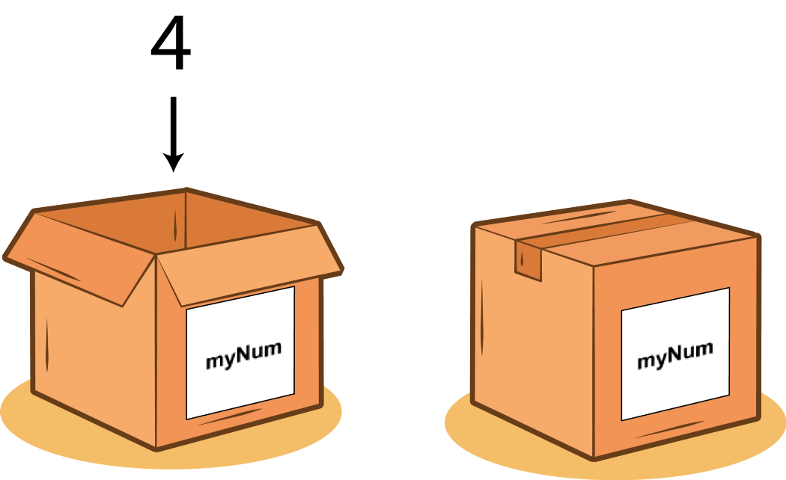

# Переменные и вывод информации

!!! info "Автор(ы)"

    - [Котенков Игорь](https://github.com/stalkermustang)

## Суть переменных в `Python`

Настало время приступить к изучению непосредственно `Python`, ведь прошло три лекции, а мы об языке программирования и не говорили вовсе! И поскольку наш курс посвящен физике, то начнем со [знакомой всем по школьным карандашам формулы](https://ru.wikipedia.org/wiki/Эквивалентность_массы_и_энергии) $E=mc^2$. По ней можно вычислить полную энергию физического объекта $E$ с помощью известной массы объекта $m$ и константы $c$. Эта постоянная, указывающая на скорость света в вакууме, используется настолько часто, что для нее выделили **отдельное обозначение в виде буквы латинского алфавита**, как и для многих других аналогичных величин. Если в формуле встречается $c$ (в известном контексте), то вы всегда уверены, что именно нужно подставить при расчетах.

Этот пример полностью описывает концепцию **переменных** в языках программирования, и `Python` не исключение. Запись $x = 3$ означает, что везде по тексту далее под иксом подразумевается именно тройка, и ничего другого (пока не будет введено новое определение). Этой же логике подчиняется `Python`. Сначала указывается **имя переменной**, а затем – ассоциируемое с ней значение.

```python linenums="1"
c = 299_792_458 # запишем константу, м/с
m = 0.5 # масса некоторого абстрактного объекта, кг
E = m * (c ** 2) # вычисляем энергию, Дж

some_variable_1 = 10.2 # какая-то другая переменная
m = 12
```

Пример кода выше иллюстрирует сразу несколько базовых концепций, которые нужно запомнить:

1. В объявлении переменной нет ничего сложного. Синтаксис и правила интуитивно понятны: это можно делать как в физике/математике, как в учебниках и статьях.
2. `#` означает комментарий, то есть произвольный текст, который не воспринимается `Python` (все **до конца строки** кода полностью игнорируется). Служит исключительно для создания подсказок в коде, объяснения происходящего, то есть для удобства.
3. Числа могут быть **целыми и вещественными**. Разряды в целых числах для удобства визуального восприятия можно разделять нижней чертой.
4. **Значение переменной может быть вычислимым**, то есть являться производной от других переменных (как $E$, ведь это результат перемножения). На самом деле значение вычисляется в момент объявления переменной (при сложной формуле расчета процесс может занимать некоторое время).
5. Операция возведения в степень реализуется с помощью `**`.
6. В качестве названия переменных можно использовать **буквы и цифры**, а также некоторые символы. Однако **имя переменной не может начинаться с цифры**.
7. Переменные можно переопределять (и даже менять тип). Однако **старое значение в этом случае будет безвозвратно утрачено**. В данном примере после выполнения последней строчки нельзя установить, чему было равно $m$ до того, как переменной было присвоено значение дюжины.

Если говорить менее строго и более абстрактно, то **переменная – это контейнер** (или коробка), в котором что-то лежит, и на самой коробке на приклеенном листочке бумаги указано содержимое. Чем понятнее надпись, тем легче найти и использовать объект (поэтому переменные с названием из одной буквы воспринимаются плохо, особенно если таких переменных очень много).

<figure markdown>
  
  <figcaption>
  [Объявить переменную -- значит положить объект в коробку с подписью](https://stevenpcurtis.medium.com/what-is-a-variable-3447ac1331b9).
  </figcaption>
</figure>

## Типы переменных

В листинге кода выше важно заметить, что существует разница между двумя типами численных переменных: **целые и вещественные**. При сугубо математических расчетах и арифметических операциях тип переменной не имеет значения. Однако для некоторого функционала в `Python` нужно быть аккуратным. Мы поговорим подробно об этом в следующих лекциях, а пока стоит запомнить, что вещи, которые необходимо посчитать – в том числе и **длину** чего-то _счетного_ – должны быть целочисленными (как и в жизни: первый, второй, третий...).

!!! warning

    Целочисленный тип называется **int** (от `Integer`), вещественный – **float**. Эти типы можно переводить из одного в другой. При переводе вещественного числа в целое теряется часть информации.

**Тип переменной** – и это относится не только к числам, но и к **любому** объекту – можно узнать с помощью функции `type`. Для вывода информации в `Python` используется функция `print`. Что именно представляет собой функция мы рассмотрим в более поздних лекциях, пока стоит думать об этом как о некотором объекте, который зависит (рассчитывается) от других объектов и выдает некоторый результат. Для передачи аргументов используются круглые скобки (аналогично математике: $y = F(x)$). Давайте скомбинируем эти знания и рассмотрим пример:

```python linenums="1"
first_variable = 10
second_variable = 10.0

# запишем в переменные значения типов данных
type_of_first_variable = type(first_variable)
type_of_second_variable = type(second_variable)

# и распечатаем сами типы, чтобы посмотреть глазами и сравнить
print(type_of_first_variable)
print(type_of_second_variable)

# перезапишем переменные
first_variable = 12.9
second_variable = int(first_variable)
third_variable = float(second_variable)

# в print() можно передавать несколько переменных
print(first_variable, second_variable, third_variable)
```

```bash linenums="1"
<class 'int'>
<class 'float'>
12.9 12 12.0
```

Внимательно проанализируйте код выше – в нем продемонстрирован базовый синтаксис **преобразования типов** и **вывода информации**. Легко увидеть подтверждение высказанных ранее тезисов: `second_variable` действительно потеряла часть информации (дробную часть числа), которую нельзя вернуть, если преобразовать переменную обратно во `float`. Преобразование типов в языках программирования называется **приведением** (типов, то есть привести одно к другому, а не из-за страшилок про духов).

## Арифметические операции с числами

Математика `Python` максимально близка к естественной: `+`, `-`, `*` и `**` (рассмотренное ранее возведение в степень) работают в точности как ожидается. С делением `/` есть нюанс: **возвращаемое значение всегда вещественное**.

```python linenums="1"
a = 3
b = 12.1

c = a + b

# можно объединять вызовы функций print и type
# без создания лишней переменной
print(type(c))

# и даже трех функций, включая приведение типа
print(type(int(c)))

# деление числа на само себя дает единицу, но..
print(a / a)
print(b / b)
print(c / c)
print(12 / 4)
```

```bash linenums="1"
<class 'float'>
<class 'int'>
1.0
1.0
1.0
3.0
```

!!! note

    Обратите внимание, что операции не изменяют переменную саму по себе (то есть операция `a + b` не меняет ни `a`, ни `b`). Чтобы сохранить получаемое значение, нужно присвоить его некоторой переменной (в примере выше это `c`). Если вы хотите изменить непосредственно саму переменную, то можно переприсвоить ей значение на основе расчета: `a = a + b` или `c = c + 12`.

Даже несмотря на то, что кейс с делением числа на само себя очевиден (всегда получается единица, кроме деления на нуль), будет выведено вещественное значение.
Сами же вещественные значения можно складывать, вычитать, умножать и возводить в степень как с целыми, так и с вещественными числами (и наоборот). Если в таком выражении используется хотя бы одна `float`-переменная, то и результат будет не целочисленным. Однако:

```python linenums="1"
a = 3
b = 2

print(a + b, type(a + b))
print(a * b, type(a * b))
print(a ** b, type(a ** b))
```

```bash linenums="1"
5 <class 'int'>
6 <class 'int'>
9 <class 'int'>
```

Это _практически_ все тонкости, которые необходимо знать, чтобы не совершать базовые ошибки.

### Примечание

Возможно, у вас родился вопрос относительно расстановки пробелов в коде выше. Обязательно ли соблюдать такой синтаксис? Нужно ли ставить пробелы до и после знаков операций? На самом деле нет: это делается исключительно для удобства чтения кода и **настоятельно рекомендуется не удаляться от стандартов языка**. Код ниже выполнится без ошибок, однако ухудшается читаемость:

```python linenums="1"
a=            3
b    =2

print(a +b, type(a+ b))
print(a     * b, type(a *b))
print(a**b, type(a        ** b))
```

```bash linenums="1"
5 <class 'int'>
6 <class 'int'>
9 <class 'int'>
```

## Строковые переменные

Мы разобрались в том, как описывать и хранить числа, как производить арифметические расчеты. Базовый математический язык освоен, но мы же люди, и хочется общаться словами! Конечно, `Python` позволяет это делать. Благодаря **строковым переменным** можно хранить и соединять текстовую информацию:

```python linenums="1"
text_variable = 'тут что-то написано'
another_text_variable = "Вася, впиши сюда что-нибудь перед публикацией курса!"

long_text = '''
Lorem ipsum dolor sit amet, consectetur adipiscing elit, sed do eiusmod tempor incididunt ut
labore et dolore magna aliqua. Ut enim ad minim veniam, quis nostrud exercitation ullamco laboris
nisi ut aliquip ex ea commodo consequat. Duis aute irure dolor in reprehenderit in voluptate velit
esse cillum dolore eu fugiat nulla pariatur. Excepteur sint occaecat cupidatat non proident, sunt
in culpa qui officia deserunt mollit anim id est laborum.
'''

print(another_text_variable)
```

```bash linenums="1"
Вася, впиши сюда что-нибудь перед публикацией курса!
```

В примере выше рассмотрено три способа создания текстовых переменных. Первые два не отличаются между собой с точки зрения `Python`, то есть неважно, используете ли вы одинарные кавычки `'` или двойные `"`. Однако стоит понимать, что если ваша строка содержит в себе такой символ, то кавычка должна быть изменена:

```python linenums="1"
error_string = 'Chillin' kid'
another_error_string = "И тут он мне говорит: "у тебя нет ног!""

print(error_string)
print(another_error_string)
```

```bash linenums="1"
  File "<ipython-input-25-7bba44e87ae0>", line 1
    error_string = 'Chillin' kid'
                             ^
SyntaxError: invalid syntax
```

Механизм ошибки таков, что `Python` неясно: это вы закончили строчку и дальше идет какая-то команда, или же строчка продолжается. В обоих случаях **нужно сменить способ создания строки** – и тогда все будет хорошо:

```python linenums="1"
error_string = "Chillin' kid"
another_error_string = 'И тут он мне говорит: "у тебя нет ног!"'

print(error_string)
print(another_error_string)
```

```bash linenums="1"
Chillin' kid
И тут он мне говорит: "у тебя нет ног!"
```

Если необходимо сохранить какой-либо объемный текст или сообщение, можно воспользоваться мультистрочным объявлением переменной, как в первом примере блока.

Строки можно объединять для удобства вывода информации:

```python linenums="1"
first_string = 'Результат вычислений: '
second_string = ". Это не так много!"

a = 12
b = 2
result = a * b

# два способа вывода:
print(first_string, result, second_string)

# либо через склейку строк вручную
# обратите внимание на приведение типа int к str
result_string = first_string + str(result) + second_string
print(result_string)
```

```bash linenums="1"
Результат вычислений:  24 . Это не так много!
Результат вычислений: 24. Это не так много!
```

!!! warning

    Будьте аккуратны со сложением строк. Объединение строк `"3"` и `"5"` даст результат `"35"`, а не `8` – и тип результирующего значения **будет строковый**. **Сложить строку и число нельзя**: вы получите ошибку и никакого приведения типов не произойдет. Здесь возникнет двусмысленность – нужно привести число к строке и затем сконкатенировать или же строку к числу (а вдруг это невозможно?), после чего сложить.

Склеивание строк называется **конкатенацией**. Попробуйте в `Jupyter`-ноутбуке объединить строковые, целочисленные и вещественные переменные в разных комбинациях. Разберитесь, что означает ошибка, которая будет выведена в случае, если не делать приведение типов (то есть без `str` в `str(result)`).

!!! note

    Обратите внимание на пробел между числом и точкой в первом случае. Они добавлены автоматически функцией `print` – это сделано для того, чтобы разные объекты при последовательном выводе не «склеивались» друг с другом. Во втором случае этого не происходит, так как мы напрямую склеиваем строки и только затем передаем результат конкатенации на печать в `print`.

Но на практике это не совсем удобно, поэтому в `Python` придумали `F`-строки. Их суть в том, что переменная из кода напрямую подставляется (с автоматическим приведением типа к строке) в саму строку! Вот:

```python linenums="1"
a = 12
b = 2
result = a * b

result_string = f'Результат вычислений: {result}. Это не так много!'

# и без f
wrong_result_string = 'Результат вычислений: {result}. Это не так много!'

print(result_string)
print(wrong_result_string)
```

```bash linenums="1"
Результат вычислений: 24. Это не так много!
Результат вычислений: {result}. Это не так много!
```

Для объявления `F`-строки нужно, во-первых, использовать одинаковые кавычки на концах текста. Во-вторых, нужно указать литеру `f` перед самой строкой. И последнее – нужно обрамить название конкретной переменной (`result` в данном случае) в фигурные скобки.

Когда переменная одна, а также нет текста после ее использования, то выгода `F`-строк не так очевидна (относительно простого `print(some_string, some_variable)`). Однако представьте, что вам нужно вывести координаты точки в трехмерном пространстве, значение времени, параметры системы и значение некоторой функции от всех переменных выше!

```python linenums="1"
# так тоже можно!
x, y, z = 12.1, 0, 13
# скобки, как и в математике, задают порядок выполнения вычислений
func_val = (x * y) ** z

current_time = 30.113412

# а вот так можно писать длинные f-строки (но работает и для обычных)
out_string = (f'В точке с координатами X={x}, Y={y}, Z={z} значение функции '
              f'равно {func_val}. Состояние системы указано на момент '
              ' времени t=' + str(current_time))

print(out_string)
```

```bash linenums="1"
В точке с координатами X=12.1, Y=0, Z=13 значение функции равно 0.0. Состояние системы указано на момент  времени t=30.113412
```

## Что мы узнали из лекции

- **Переменные – это «контейнеры»**, в которые можно что-то положить и дать название.
- Математика в `Python` не имеет сложных правил, процесс вычислений максимально интуитивен.
- Арифметические операции могут **менять тип** результирующей переменной.
- `type()`, `print()` – базовые функции, с помощью которых можно делать **самопроверки** по ходу написания кода.
- **Сменить тип** переменной можно вызовом функций `int()`, `float()`, `str()`.
- Строки могут обрамляться как `'`, так и `"` (но этих символов **не должно быть внутри** текста).
- `F`-строки облегчают комплексный вывод, содержащий как текст, так и переменные `Python` (и автоматически приводит типы).
