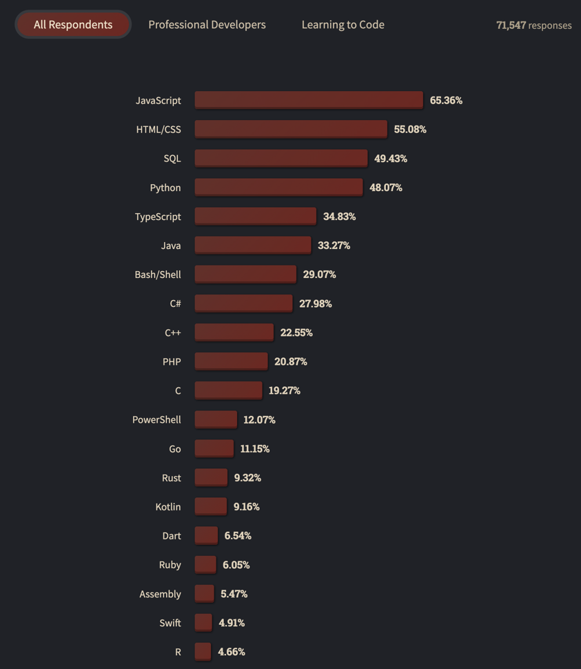
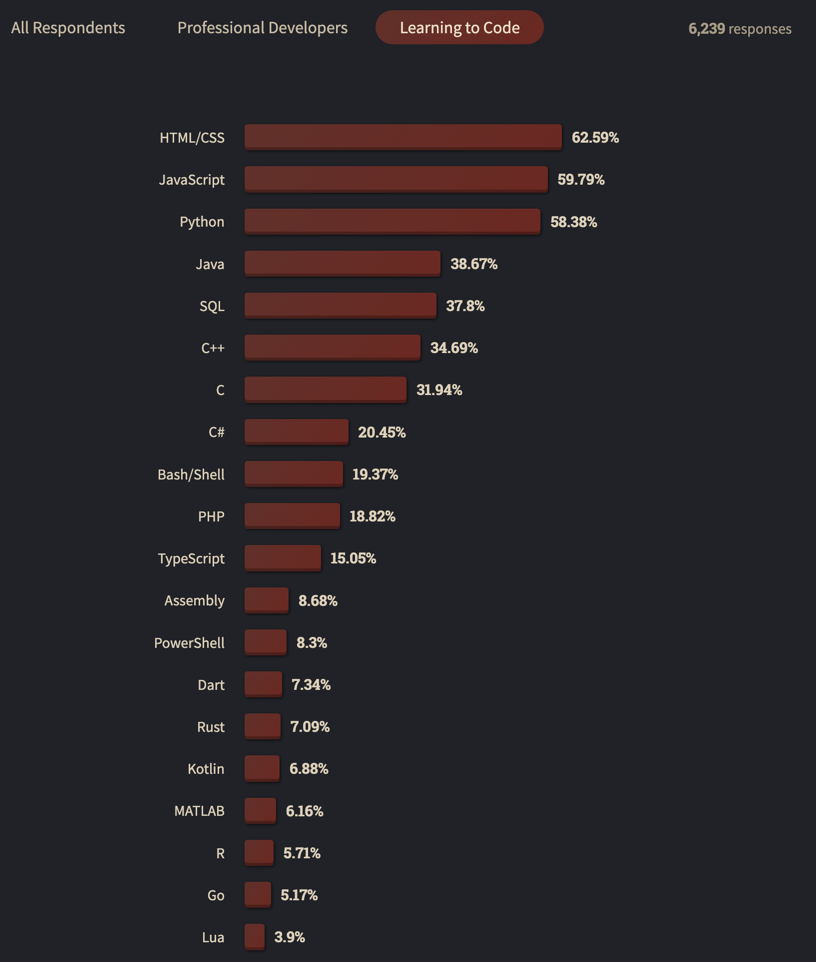
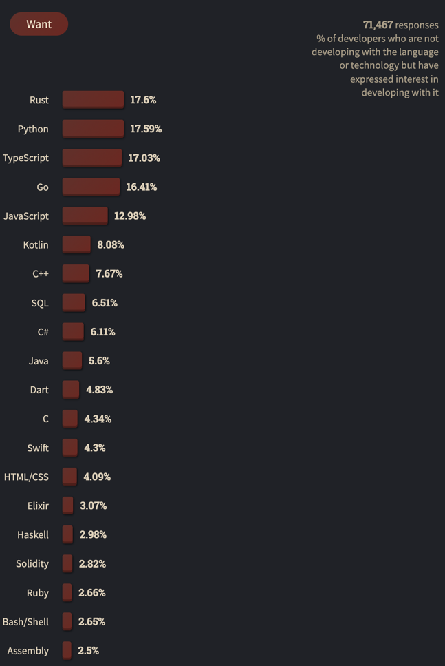
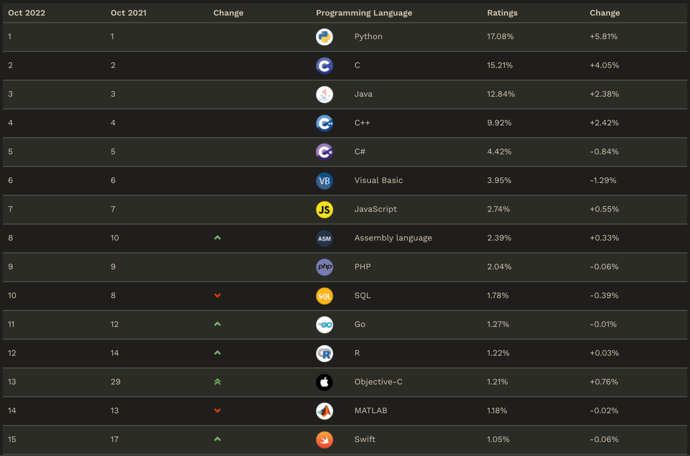

# Почему Python?

!!! info "Автор(ы)"

    - [Kosarevsky Dmitry](https://github.com/dKosarevsky)

## Возможности Python

[Python](https://www.python.org/) – активно развивающийся язык программирования предназначенный для решения большого
числа различных задач. Простота в изучении, легкость в написании и чтении кода и лаконичность делают этот язык
привлекательным и популярным. Одна из сильных сторон языка `Python` - его стандартная библиотека, которая позволяет
выполнить широкий спектр задач без установки дополнительного ПО. Существуют библиотеки сторонних производителей, которые
являются более интересными аналогами некоторых функций стандартной библиотеки (например `NumPy` - библиотека для решения
вычислительных задач).

Пример некоторых задач, которые можно решить с помощью `Python` и библиотек для таких решений:

* создавать web-приложения ([Django](https://www.djangoproject.com/), [Flask](https://flask.palletsprojects.com/));
* разрабатывать игры ([Pygame](https://www.pygame.org/));
* разрабатывать мобильные приложения ([Kivy](https://kivy.org/));
* работать с текстовыми файлами, изображениями, аудио и видео файлами ([PyMedia](http://pymedia.org/));
* реализовывать графический интерфейс пользователя ([PyQT](https://riverbankcomputing.com/software/pyqt/)
  , [PyGObject](https://pygobject.readthedocs.io/));
* заниматься научными и математическими вычислениями ([SciPy](https://scipy.org/), [NumPy](https://numpy.org/)
  , [SymPy](https://www.sympy.org/));
* заниматься анализом данных ([Pandas](https://pandas.pydata.org/));
* строить визуализации на основе данных ([Matplotlib](https://matplotlib.org/), [seaborn](https://seaborn.pydata.org/)
  , [Plotly](https://plotly.com/python/));
* проводить статистические исследования ([statsmodels](https://www.statsmodels.org/));
* заниматься машинным обучением ([scikit-learn](https://scikit-learn.org/));
* создавать нейронные сети ([PyTorch](https://pytorch.org/), [TensorFlow](https://www.tensorflow.org/));
* и многое другое.

## Опросы Stack Overflow

Ежегодные [опросы Stack Overflow в мае 2022](https://survey.stackoverflow.co/2022/) года определили, что `JavaScript`
десятый год подряд становится наиболее часто используемым языком программирования. (65.36%, в предыдущем году - 64.9%,
большинство участников Stack Overflow web-разработчики).



Но для тех, кто учится программировать, картина другая. `HTML/CSS`, `Javascript` и `Python` почти связаны как самые
популярные языки для людей, изучающих программирование. Люди, изучающие программирование, чаще, чем профессиональные
разработчики, сообщают об использовании `Python` (58% против 44%), `C++` (35% против 20%) и `C` (32% против 17%).



Пять лет подряд `Python` определялся участниками опросов как наиболее востребованная технология, однако в 2022
`Rust` незначительно опередил `Python`:



## Рейтинг языков программирования

<figure markdown>
  
  <figcaption>
  Рейтинг популярности языков программирования по данным индекса TIOBE на октябрь 2022 года.
  </figcaption>
</figure>

Рейтинг [TIOBE](https://www.tiobe.com/tiobe-index/) составляется из всех актуальных языков программирования (около 100).
Как видно из рейтинга, `Python`возглавляет рейтинг. Такой успех можно объяснить возможностью выполнения широкого спектра
задач и удобством языка. Удобство заключается в том, что `Python` - высокоуровневый язык. Это означает, что сложные
описания структур машинного кода выполнены в удобно читаемом для человека виде. Стоит отметить, что при изучении языка
необходимо уделять больше времени пониманию того, как работают стандартные функции, поскольку это позволит быстрее
прокачивать свой навык программирования.

## Почему Python востребован в Data Science?

Бизнес во многих отраслях осознаёт важность получения как можно большего количества информации из своих данных, что создаёт высокий спрос на `Python`. Такой спрос на `Python` в Data Science возник из-за универсальности языка программирования, который позволяет ускорить процессы обработки данных и эффективно удовлетворить потребности бизнеса.

Популярность Python для специалистов по данным возросла, потому что ему легко обучить, его легко изучить и его просто
использовать. `Python` идеально подходит как для новичков в области работы с данными, так и для опытных программистов,
которые хотят сменить карьеру на индустрию данных.

### Бизнес предпочитают Python другим технологиям для выполнения ежедневных задач с данными

`Python` можно классифицировать как универсальный язык программирования, который позволяет специалистам по данным быстро
выполнять основные ежедневные задачи с данными, что делает `Python` настолько привлекательным для бизнеса в различных
отраслях, которые ищут специалистов по данным. Навыки программирования на `Python` стали визитной карточкой настоящего
специалиста по данным для специалистов по найму и работодателей.

Вот 3 основные причины, по которым компании предпочитают `Python` другим технологиям, таким как `Matlab`, `R`, `Java`
или `C`, для выполнения повседневных задач по обработке данных:

* **Универсальность** - Универсальность `Python` позволяет специалистам по данным быстро и легко выполнять задачи
  по обработке данных, статистике, математике, машинному обучению и визуализации в одной среде разработки.
* **Open-source** - `Python` имеет открытый исходный код, а его стандартные библиотеки позволяют пользователям
  экономить, столь ценное для бизнеса, время при разработке решений и тестировании продуктов с использованием структур
  данных `Python`, инструментов анализа и изменяемого исходного кода.
* **Удобный для пользователя** - `Python` считается одним из самых удобных для пользователя и объектно-ориентированных
  языков для изучения начинающими программистами и людьми, меняющими профессию, из-за его простоты использования и
  поддержки онлайн-сообщества. Например, в интерфейсе `Python` используется простой для понимания код со встроенными
  типами данных и динамической типизацией для ускоренной разработки, тестирования и внедрения прототипов.

Сравнение, как выглядит одна и та же функция, написанная на `Java` и на `Python`:

расчёт факториала на `Java`:

```Java linenums="1"
class Factorial
{
    static int factorial(int n)
    {
        if (n == 0)
          return 1;
        return n*factorial(n-1);
    }

    public static void main(String[] args)
    {
        System.out.println(factorial(5));
    }
}
```

расчёт факториала на `Python`:

```python linenums="1"
def factorial(n):
    return 1 if (n==1 or n==0) else n * factorial(n - 1)

print(factorial(5))
```

### Как Python используется в Data Science и машинном обучении?

Когда дело доходит до выбора языка программирования в Data Science, он всегда определяется типом проекта, над которым
вы работали.

В настоящее время `Python` чаще всего используется в индустрии при разработке, тестировании и реализации проектов и
процессов автоматизированного машинного обучения.

Исследователь данных или инженер по машинному обучению будет использовать `Python` при выполнении проектов
искусственного интеллекта и машинного обучения, включающих анализ настроений, обработку естественного языка или
предиктивную аналитику, чтобы получать информацию о полезных тенденциях и закономерностях из структурированных и
неструктурированных наборов данных.

Это стало возможным благодаря развивающимся и бесплатным для всех пакетам библиотек `Python`, предназначенным для
упрощения разработки, тестирования и выполнения проектов машинного обучения для специалистов по данным.

Конкретные примеры ниже иллюстрируют, как некоторые из этих библиотек `Python` используются в индустрии для ключевых
задач в операциях, связанных с Data Science, для каждого бизнеса, включая обработку данных, анализ, манипулирование,
автоматизацию и машинное обучение:

* **NumPy** - используется для числового анализа данных, изображений и текста.
* **SciPy** - используется для научных вычислений
* **Pandas** - используется для машинного обучения и расширенной обработки данных.
* **Scikit-learn** - используется для машинного обучения, визуализации данных, обработки изображений/текстовых данных.
* **Matplotlib** - используется для визуализации данных

### Применение Python в ведущих компаниях, ориентированных на данные, и будущее Python в Data Science

Индустрия данных стала доверять `Python` как многоцелевому языку программирования.

Уверенность и рост среди пользователей `Python` развивались по мере того, как `Python` доказывал свою способность
адаптироваться к ежедневным требованиям компаний к данным, ориентированных на пользователей. `Python` позволил этим
компаниям быстро и эффективно выполнять необходимые задачи по анализу данных, визуализации, автоматизации и машинному
обучению.

Вот лишь некоторые из способов, которыми 3 ведущие компании, работающие с данными, используют `Python`:

* **Netflix** - `Python` повсеместно используется службой создания контента и потоковой передачи `Netflix` ее группами
  по Data Science и инженерами для анализа данных на стороне сервера, визуализации и тестирования, прогнозной
  аналитики данных, автоматизации оповещений и безопасности, а также мониторинга данных в реальном времени и разработки
  внутренних операционных процессов. Например, персонализированные плейлисты `Netflix` _«Вы должны посмотреть это
  следующим, потому что вы смотрели…»_ используют алгоритмы глубокого обучения и прогнозной аналитики, чтобы дать вам
  конкретные рекомендации, основанные на вашей индивидуальной аналитике поведенческих данных.
* **Meta** - `Python` всё чаще используется социальной сетью `Facebook` для проектирования, управления
  инфраструктурой и операционной автоматизации. Чтобы удовлетворить свои критические потребности пользователей в
  обновлениях в реальном времени, удобстве использования и подключении, `Facebook` приобрела и внедрила
  платформу [Tornado](https://www.tornadoweb.org/en/stable/), написанную на `Python` (теперь с открытым исходным кодом),
  которая быстро обрабатывает обширный веб-трафик, предоставляя пользователям эффективную работу в режиме реального
  времени каждый раз, когда они входят в систему.
* **Google** - `Python` используется технологическим гигантом `Google` в максимально возможной степени - включая анализ
  данных, тестирование и мониторинг, автоматизацию и прогнозную аналитику, веб-приложения и разработку и т.д. `Google`
  также использовал `Python` для создания фреймворка глубокого обучения `TensorFlow`, который используется для проектов
  машинного обучения компаний по всему миру.

Ожидается, что в будущем `Python` и Data Science сохранят прочное партнерство благодаря приверженности `Python`
разработке и регулярному выпуску обновлений, отвечающих требованиям индустрии данных и новых технологий. Если среда
программирования `Python` продолжит расширять свои возможности и универсальность, она по-прежнему будет предпочтительным
языком для компаний, проектов и специалистов по работе с данными.

### Изучите Python, чтобы подготовиться к успешной карьере в Data Science!

Если вы заинтересованы в карьере связанной с индустрией данных, вы можете подготовиться к успеху, пройдя настоящий
курс о языке программирования `Python`.

Изучение использования `Python` для Data Science даст вам конкурентное преимущество при поиске первой работы или при
смене карьеры связанной с индустрией данных.

!!! info "Совет"

    Рекомендуется в процессе изучения заглядывать в официальную документацию и в частности в [The Python Tutorial](https://docs.python.org/3/tutorial/).
