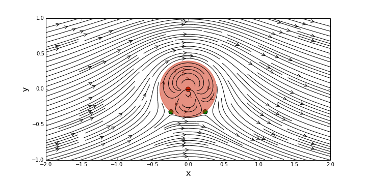
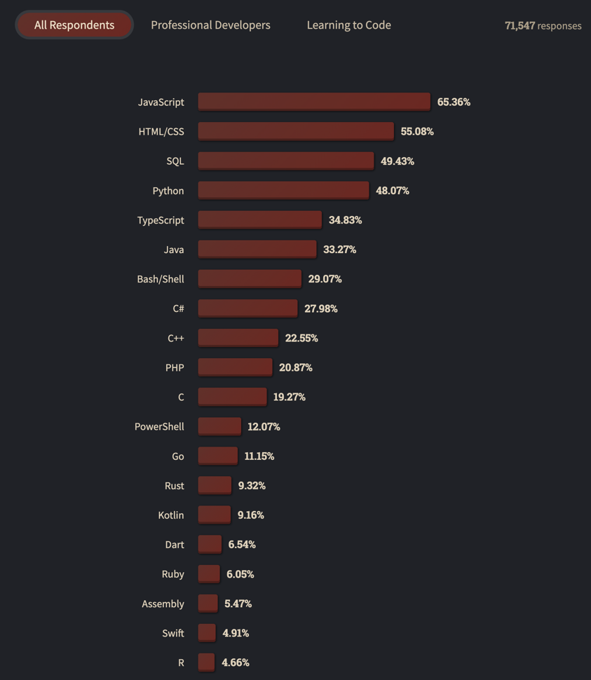
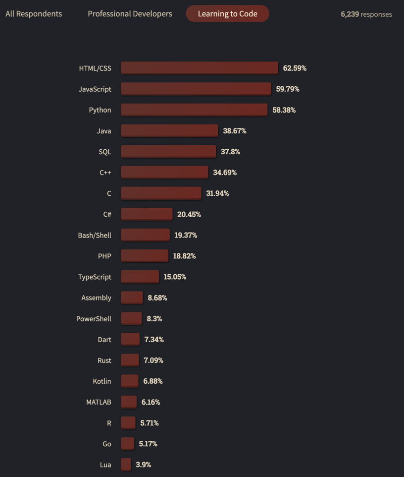
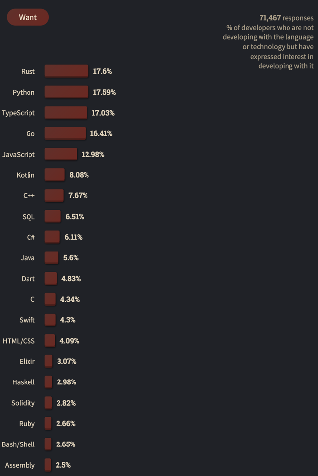
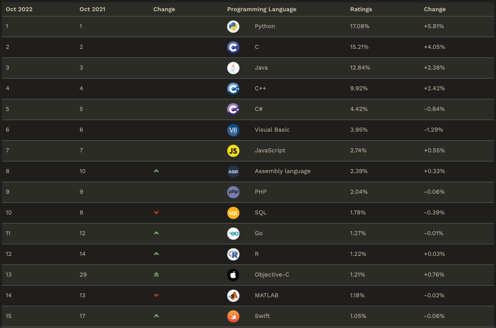

# главная

```
 __      ___       __         __  ___   __   __   __  
|__) \_/  |  |__| /  \ |\ |  /  \  |   /  \ |  \ (_    /\  |
|     |   |  |  | \__/ | \|  \__/  |   \__/ |__/ __) ./--\ |
```

!!! danger "О чём это всё"

    В этом чудесном месте планируется затронуть основные моменты Python (с упором на машинное обучение): база, как работать с основными библиотеками, что есть правильный код, асинхронность, тесты и т.д. и т.п. Кто-то без умолку уронит замечание, дескать, этого всего сполна, но тут упор делаем на примеры в той самой промышленности. Будем рады любой помощи в составлении материалов, практики и иного доброго словца – [contributing.md](https://github.com/open-data-science/pycourse/blob/master/contributing.md).

    Проект находится в стадии разработки «основы python». Подискутировать о курсе можно [тут](https://github.com/open-data-science/pycourse/discussions).

    [Посмотреть прогресс курса](https://github.com/orgs/open-data-science/projects/1/views/1){ .md-button .md-button--primary }

[Python](https://www.python.org/) есть такой язык программирования, который позволяет сообщить компьютеру о том, что нужно сделать, дабы достичь некоего результата. За последнее десятилетие он получил быстрое распространение и сейчас является одним из самых популярных языков программирования в мире. Входной порог для его использования достаточно низок: можно использовать Python для решения своих задач даже если никогда не имели дела с программированием.

## Что такое Python?

Python – это язык программирования ^^общего назначения^^, используемый для различных задач, например:

- [x] анализ данных ([Pandas](https://pandas.pydata.org/))
- [x] построение визуализаций на основе данных ([Matplotlib](https://matplotlib.org/), [seaborn](https://seaborn.pydata.org/), [Plotly](https://plotly.com/python/))
- [x] научные и математические вычисления ([SciPy](https://scipy.org/), [NumPy](https://numpy.org/), [SymPy](https://www.sympy.org/))
- [x] квантовое вычисление ([Cirq](https://github.com/quantumlib/cirq), [Qiskit](https://github.com/Qiskit/qiskit), [PennyLane](https://github.com/PennyLaneAI/pennylane))
- [x] статистические исследования ([statsmodels](https://www.statsmodels.org/))
- [x] машинное обучение ([scikit-learn](https://scikit-learn.org/))
- [x] продвинутая аналитика данных, в том числе с использованием нейронных сетей ([PyTorch](https://pytorch.org/), [TensorFlow](https://www.tensorflow.org/))
- [x] компьютерная графика ([blender](https://www.blender.org/))
- [x] геофизика ([pyGIMLi](https://www.pygimli.org/), [SimPEG](https://simpeg.xyz/))
- [x] химия ([awesome-python-chemistry](https://github.com/lmmentel/awesome-python-chemistry))
- [x] теория графов ([NetworkX](https://networkx.org/))
- [x] медицина ([PyQtGraph](https://www.pyqtgraph.org/))
- [x] психология ([PsychoPy](https://www.psychopy.org/))
- [x] разработка веб-приложений ([Django](https://www.djangoproject.com/), [Flask](https://flask.palletsprojects.com/))
- [x] разработка мобильных приложений ([Kivy](https://kivy.org/))
- [x] работа с текстовыми файлами, изображениями, аудио и видео файлами ([PyMedia](http://pymedia.org/))
- [x] создание игр ([Pygame](https://www.pygame.org/))
- [x] реализация графических интерфейсов ([PyQT](https://riverbankcomputing.com/software/pyqt/), [PyGObject](https://pygobject.readthedocs.io/))
- [x] и т.д. и т.п.

<figure markdown>
  
  <figcaption>
  [Рассчитанная в Python симуляция преломлений света черной дырой](https://github.com/Python-simulation/Black-hole-simulation-using-python)
  </figcaption>
</figure>

## Чем примечателен Python?

В основе разностороннего применения и популярности лежит ^^простота изучения^^: всё чаще люди начинают свой путь в программировании с Python, поскольку он очень ^^дружелюбен к новичкам^^ и позволяет максимально быстро перейти к решению целевой задачи.

Сюда же можно отнести ^^многообразие библиотек^^ (или _расширений функциональности_, то есть кода, написанного другими людьми, который можно переиспользовать). Хотите изучить физику небесных тел и симулировать их взаимодействия? Можно найти и скачать библиотеку, позволяющую за один вечер провести вычисления, о которых в прошлом веке можно было лишь мечтать. Хотите создать прототип мобильного приложения? И на этот случай есть библиотека. Вам нравится квантовая физика и хотите использовать её вместе с умными компьютерными алгоритмами? Что ж, тогда снова по адресу.

<figure markdown>
  
  <figcaption>
  [Пример моделирования аэродинамики в Python с помощью библиотеки AeroPython](https://lorenabarba.com/blog/announcing-aeropython/)
  </figcaption>
</figure>

Python – это ^^высокоуровневый язык для быстрой разработки и/или прототипирования^^, на нем очень удобно проверять гипотезы и идеи. «_Высокоуровневый_» означает, что не нужно вникать в устройство компьютера и тонкости взаимодействия с ним, чтобы перейти к задаче. Многое «сделано за нас»: работаем с простыми _абстракциями_ (или удобными представлениями), а не боремся с компьютером из-за непонимания сложностей его устройства.

Еще один плюс в копилку популярности языка – это ^^элегантность и краткость синтаксиса^^ (принципов написания кода, как будто это абзацы в тексте или колонки в газете). Вместе с вышеупомянутым обилием библиотек можно буквально за 5 минут и 10 строк кода – а это меньше половины листа А4 – воспроизвести научную статью, в которую вложено несколько человеко-лет. А еще такой синтаксис делает ^^код легким для чтения, запоминания и понимания^^.

Стоит отметить, что Python – это ^^интерпретируемый^^ язык, а значит, компьютер каждый раз перед выполнением программы читает код строчку за строчкой и определяет (интерпретирует), что нужно сделать дальше, не проводя никаких оптимизаций и предварительных расчетов. Это негативно влияет на общую скорость работы: Python является ^^одним из самых медленных языков^^. Тем не менее он отлично подходит для академических целей, например, исследовательской работы или других задач, где скорость работы не является критически важной. Настоящая сила Python заключается в том, что это ^^«язык-клей»^^: он обеспечивает удобный доступ к различным библиотекам, написанным на высокоэффективных языках, например, на C/C++, Fortran, CUDA C и других.

## И в чем подвох?

В простоте языка и его доступности для быстрого старта таится одна из проблем: _можно не понимать, что происходит внутри_, поэтому иногда бывает сложно разобраться в причинах ошибок и неточностей, возникающих по ходу работы над задачей. В целом к Python применим следующий принцип: «легко научиться, трудно овладеть». Возвращаясь к примеру элегантности кода, когда 10 строк кода выполняют всю работу: важно понимать, что за ними стоят еще _сотни_ или даже _тысячи строк кода_, а это может приводить к ситуациям, когда поиск ошибки в минимальном наборе команд растягивается на несколько дней.

## Опросы Stack Overflow

Ежегодные [опросы Stack Overflow в мае 2022](https://survey.stackoverflow.co/2022/) года определили, что JavaScript десятый год подряд становится наиболее часто используемым языком программирования. (65,36%, в предыдущем году - 64,9%, большинство участников Stack Overflow web-разработчики).



Но для тех, кто учится программировать, картина другая. HTML/CSS, Javascript и Python почти связаны как самые популярные языки для людей, изучающих программирование. Люди, изучающие программирование, чаще, чем профессиональные разработчики, сообщают об использовании Python (58% против 44%), C++ (35% против 20%) и C (32% против 17%).



Пять лет подряд Python определялся участниками опросов как наиболее востребованная технология, однако в 2022 Rust незначительно опередил Python:



## Рейтинг языков программирования

<figure markdown>
  
  <figcaption>
  Рейтинг популярности языков программирования по данным индекса TIOBE на октябрь 2022 года.
  </figcaption>
</figure>

Рейтинг [TIOBE](https://www.tiobe.com/tiobe-index/) составляется из всех актуальных языков программирования (около 100). Как видно из рейтинга, Python возглавляет рейтинг. Такой успех можно объяснить возможностью выполнения широкого спектра задач и удобством языка. Удобство заключается в том, что Python - высокоуровневый язык. Это означает, что сложные описания структур машинного кода выполнены в удобно читаемом для человека виде. Стоит отметить, что при изучении языка необходимо уделять больше времени пониманию того, как работают стандартные функции, поскольку это позволит быстрее прокачивать свой навык программирования.

## Минусы Python

Python — отличный выбор для практически любого проекта. Но если он выбран, важно понимать и о последствиях такого выбора.
Ограничения Python по сравнению с другими языками:

- ^^ограничения скорости^^ - поскольку Python интерпретируется, это часто приводит к медленному выполнению, однако, это не проблема, если скорость не является ключевым фактором для жизнедеятельности проекта
- ^^слаб в мобильных вычислениях и браузерах^^ - хотя Python служит отличным серверным языком, он редко встречается на стороне клиента
- ^^ограничения дизайна^^ - Python имеет динамическую типизацию. Это означает, что не нужно объявлять тип переменной при написании кода. Хотя это очень удобно для разработчиков при написании кода, но это может привести к ошибкам при исполнении и чтении кода
- ^^недостаточно развитые уровни доступа к базе данных^^ - по сравнению с более широко используемыми технологиями, такими как JDBC (Java DataBase Connectivity) и ODBC (Open DataBase Connectivity), уровни доступа к базе данных Python немного недоработаны; следовательно, он реже применяется на крупных предприятиях

Несмотря на некоторые проблемы со скоростью, безопасностью и временем выполнения, Python — ^^отличный язык для изучения^^.

Его популярность говорит сама за себя и это объясняется тем, что он простой, интерпретируемый, объектно-ориентированный, расширяемый, встраиваемый, переносимый и читабельный.

## Почему Python востребован в Data Science?

Бизнес во многих отраслях осознаёт важность получения как можно большего количества информации из своих данных, что создаёт высокий спрос на Python. Такой спрос на Python в Data Science возник из-за универсальности языка программирования, который позволяет ускорить процессы обработки данных и эффективно удовлетворить потребности бизнеса.

Популярность Python для специалистов по данным возросла, потому что легко обучить, изучить и просто использовать. Python идеально подходит как для новичков в области работы с данными, так и для опытных программистов, которые хотят сменить карьеру на индустрию данных.

### Бизнес предпочитают Python другим технологиям для выполнения ежедневных задач с данными

Python можно классифицировать как универсальный язык программирования, который позволяет специалистам по данным быстро выполнять основные ежедневные задачи с данными, что делает Python настолько привлекательным для бизнеса в различных отраслях, которые ищут специалистов по данным. Навыки программирования на Python стали визитной карточкой настоящего специалиста по данным для специалистов по найму и работодателей.

Вот 3 основные причины, по которым компании предпочитают Python другим технологиям, таким как Matlab, R, Java или C, для выполнения повседневных задач по обработке данных:

- **универсальность** - Python позволяет специалистам по данным быстро и легко выполнять задачи по обработке данных, статистике, математике, машинному обучению и визуализации в одной среде разработки
- **open-source** - Python имеет открытый исходный код, а его стандартные библиотеки позволяют пользователям экономить, столь ценное для бизнеса, время при разработке решений и тестировании продуктов с использованием структур данных Python, инструментов анализа и изменяемого исходного кода
- **удобный для пользователя** - Python считается одним из самых удобных для пользователя и объектно-ориентированных языков для изучения начинающими программистами и людьми, меняющими профессию, из-за его простоты использования и поддержки онлайн-сообщества. Например, в интерфейсе Python используется простой для понимания код со встроенными типами данных и динамической типизацией для ускоренной разработки, тестирования и внедрения прототипов.

Сравнение, как выглядит одна и та же функция (расчёт факториала), написанная на Java и на Python:

```Java linenums="1" title="Java"
class Factorial
{
    static int factorial(int n)
    {
        if (n == 0)
          return 1;
        return n*factorial(n-1);
    }

    public static void main(String[] args)
    {
        System.out.println(factorial(5));
    }
}
```

```python linenums="1" title="Python"
def factorial(n):
    return 1 if (n==1 or n==0) else n * factorial(n - 1)

print(factorial(5))
```

### Как Python используется в Data Science и машинном обучении?

Когда дело доходит до выбора языка программирования в Data Science, он всегда определяется типом проекта, над которым была проделана работа.

В настоящее время Python чаще всего используется в индустрии при разработке, тестировании и реализации проектов и процессов автоматизированного машинного обучения.

Исследователь данных или инженер по машинному обучению будет использовать Python при выполнении проектов искусственного интеллекта и машинного обучения, включающих анализ настроений, обработку естественного языка или предиктивную аналитику, чтобы получать информацию о полезных тенденциях и закономерностях из структурированных и неструктурированных наборов данных.

Это стало возможным благодаря развивающимся и бесплатным для всех пакетам библиотек Python, предназначенным для упрощения разработки, тестирования и выполнения проектов машинного обучения для специалистов по данным.

Конкретные примеры ниже иллюстрируют, как некоторые из этих библиотек Python используются в индустрии для ключевых задач в операциях, связанных с Data Science, для каждого бизнеса, включая обработку данных, анализ, манипулирование, автоматизацию и машинное обучение:

- **NumPy** - числового анализа данных, изображений и текста
- **SciPy** - научных вычислений
- **Pandas** - расширенной обработки данных
- **Scikit-learn** - машинного обучения, визуализации данных, обработки изображений/текстовых данных
- **Matplotlib** - визуализации данных

### Применение Python в ведущих компаниях, ориентированных на данные, и будущее Python в Data Science

Индустрия данных стала доверять Python как многоцелевому языку программирования.

Уверенность и рост среди пользователей Python развивались по мере того, как Python доказывал свою способность адаптироваться к ежедневным требованиям компаний к данным, ориентированных на пользователей. Python позволил этим компаниям быстро и эффективно выполнять необходимые задачи по анализу данных, визуализации, автоматизации и машинному обучению.

Python используют практически все крупные компании, о которых слышим каждый день: Сбер, Авито, Лента, VK, МТС, МегаФон, Miro, Лаборатория Касперского, ЦФТ, ВТБ.. список можно продолжать почти что бесконечно.

Вот лишь некоторые из способов, которыми ведущие компании планеты, работающие с данными, используют Python:

- **Yandex** - Python [используется в Яндекс](https://habr.com/ru/company/yandex/blog/509352/) уже более 15 лет и за это время было как переписано многое с различных языков программирования, например с Perl так и написано много с нуля. Python используют практически в каждом сервисе в том или ином виде. Активно используют фреймворк Django для создания web-сервисов, таких как Афишу, Погоду, Телепрограмму и другие. Примерно 15 лет назад практически весь backend был написан на C++ и переход на Python позволил сильно ускорить разработку сервисов. Активно используют почти все современные фреймворки, такие как Flask, [Celery](https://docs.celeryq.dev/), [Falcon](https://falcon.readthedocs.io/), которые как и Django написаны на Python. Для написания асинхронного кода используют такие фреймворки как [Tornado](https://www.tornadoweb.org/en/stable/), [Twisted](https://twisted.org/) и модуль стандартной библиотеки [asyncio](https://docs.python.org/3/library/asyncio.html). Что касается Data Science, то и тут Python не обошли стороной: был разработан известный в кругах специалистов по машинному обучению фреймворк [CatBoost](https://catboost.ai/), и хотя для написания такого фреймворка [использовались и другие языки](https://github.com/catboost/catboost), тем не менее вклад Python примерно в 25% общего кода имеет достаточно большой вклад в проект.
- **VK** - Python всё чаще используется социальной сетью ВКонтакте для проектирования, управления инфраструктурой и операционной автоматизации. Чтобы удовлетворить свои критические потребности пользователей в обновлениях в реальном времени, удобстве использования и подключении, ВКонтакте использует фреймворки, написанные на Python, которые быстро обрабатывает обширный веб-трафик, предоставляя пользователям эффективную работу в режиме реального времени каждый раз, когда они входят в систему. Также [используют Python](https://github.com/topics/vk-api) для своего API.
- **Netflix** - Python повсеместно используется службой создания контента и потоковой передачи ее группами по Data Science и инженерами для анализа данных на стороне сервера, визуализации и тестирования, прогнозной аналитики данных, автоматизации оповещений и безопасности, а также мониторинга данных в реальном времени и разработки внутренних операционных процессов. Например, персонализированные плейлисты _«Вы должны посмотреть это следующим, потому что вы смотрели…»_ используют алгоритмы глубокого обучения и прогнозной аналитики, чтобы дать конкретные рекомендации, основанные на индивидуальной аналитике поведенческих данных.
- **Google** - Python используется в максимально возможной степени - включая анализ данных, тестирование и мониторинг, автоматизацию и прогнозную аналитику, веб-приложения и разработку и т.д. Также использовал Python для создания фреймворка глубокого обучения TensorFlow, который используется для проектов машинного обучения компаний по всему миру.

!!! quote "Личное мнение"

    Ожидается, что в будущем Python и Data Science сохранят прочное партнерство благодаря приверженности Python разработке и регулярному выпуску обновлений, отвечающих требованиям индустрии данных и новых технологий. Если среда программирования Python продолжит расширять свои возможности и универсальность, она по-прежнему будет предпочтительным языком для компаний, проектов и специалистов по работе с данными.

### Изучите Python, чтобы подготовиться к успешной карьере в Data Science!

Если есть заинтересованность в карьере связанной с индустрией данных, можно подготовиться к успеху, пройдя этот настоящий курс о языке программирования Python.

Изучение использования Python для Data Science даст конкурентное преимущество при поиске первой работы или при смене карьеры связанной с индустрией данных.

!!! info "Совет"

    Рекомендуется в процессе изучения заглядывать в официальную документацию и в частности [The Python Tutorial](https://docs.python.org/3/tutorial/).

## Интересные факты про Python

- Разработчик языка Гвидо ван Россум назвал его в честь популярного британского комедийного телешоу 1970-х «Летающий цирк Монти Пайтона»
- Актуальной версией Python считаются версии `3.6` и выше (`3.7`, `3.8.12`..). Долгое время (до 2020) года существовал `Python2`, который ныне не поддерживается и не обновляется. Если видите кусок кода на `Python2` и вам предстоит работать с ним, возможно, сначала придется его переписать, хотя большая часть кода имеет совместимость и работает корректно. Естественно тут не будем изучать `Python2`
- Довольно огромное сообщество: большинство проблем, с которыми можете столкнуться, уже было озвучено и даже решено. Это означает, что используя поисковик, можете решить практически все проблемы в течение 10-30 минут. Главное – научиться правильно формулировать свои вопросы
- При работе с Python следует придерживаться принципа «должен существовать один и, желательно, только один очевидный способ сделать это». Другие принципы (`Дзен Питона`) на русском языке – [по ссылке](https://tyapk.ru/blog/post/the-zen-of-python)
- Python – это ^^открытый проект^^, в который каждый может внести изменения (но они должны быть предварительно одобрены), например, [тут](https://mail.python.org/archives/list/python-ideas@python.org/)
- Есть целый набор рекомендаций и предложений по улучшению кода (`PEP`, [Python Enhancement Proposals](https://www.python.org/dev/peps/)). Они содержат указания на то, как следует писать код и чего стоит избегать, а также дискуссии о будущих изменениях в языке
- Язык постоянно развивается, в нем появляются новые возможности, улучшается производительность (скорость выполнения)
- Сборник всех существующих в открытом доступе библиотек находится по адресу [pypi.org](https://pypi.org/)
- Если столкнетесь с багом (системной ошибкой, вызванной внутренним механизмом языка), то сообщить об этом можно [на специальном сайте](https://bugs.python.org/)
