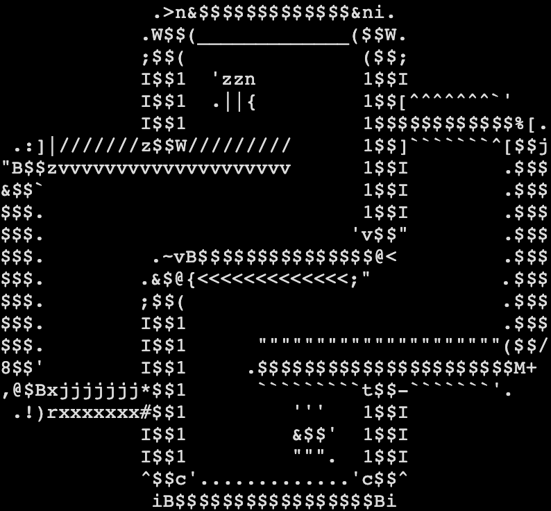

</img>
```
 __      ___       __          __  ___    __   __   __  
|__) \_/  |  |__| /  \ |\ |   /  \  |    /  \ |  \ (_      /\  |
|     |   |  |  | \__/ | \|   \__/  |    \__/ |__/ __) .  /--\ |
```
</br></br>

В этом чудесном месте планируется затронуть основные моменты Python (с упором на машинное обучение)

- база
- как работать с основными библиотеками
- что есть правильный код
- асинхронность
- тесты
- ..

Кто-то без умолку уронит замечание, дескать, этого всего сполна, но тут упор делаем на примеры в той самой промышленности.

Проект находится в стадии разработки «основы python».
